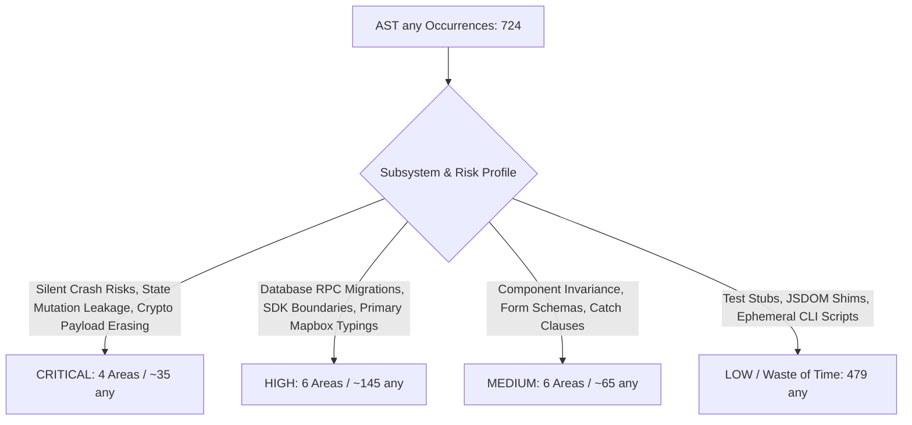

# TypeScript Code Health Audit: Prioritized `any` Remediation Roadmap

> **Target Repository:** [jarredb9/finger-lakes-app-57](https://github.com/jarredb9/finger-lakes-app-57)  
> **Context:** 18-month Next.js 16 (App Router) / React 19 / Supabase / Zustand / Deno codebase.  
> **Objective:** Systematically classify and remediate `any` types based on runtime safety, regression risk, and engineering ROI.  
> **Guiding Principle:** Focus strictly on TypeScript best practices that eliminate runtime bugs and improve developer velocity. Items where strict typing is mostly a waste of time (e.g., test component stubs, DOM shims, internal CLI scripts) are categorized as **Low Priority** with a recommendation to leave as-is.

---

## 1. Architectural Alignment & Key Decisions

1. **Map Engine Strategy:**
   - **Primary Engine:** Mapbox GL JS (`react-map-gl/mapbox` / `mapbox-gl`) is the primary rendering, clustering, and interactive map interface.
   - **Fallback Engine:** Google Maps (`components/map/google-map-fallback.tsx`) is the dynamic fallback triggered by `MapErrorBoundary` for non-GPU or WebGL-disabled client environments.
   - **Impact on Typing:** Mapbox type declarations and shims (`lib/shims.d.ts`, `mapboxgl.GeoJSONSource`) represent core production architecture and should be typed properly in the map layer refactor rather than discarded.
2. **Supabase RPC Signatures & Type Generation:**
   - Instead of relying on manual client-side assertion wrappers, PostgreSQL functions in `supabase/migrations/*` will be updated from `RETURNS jsonb` to `RETURNS TABLE (...)` following the **expand-and-contract pattern**.
   - This enables the Supabase CLI (`npm run db:gen-types`) to generate strongly typed return shapes automatically, solving the 70+ compilation errors that occur when parameterizing `createBrowserClient<Database>`.
3. **Test Code vs. Production Safety:**
   - 61.6% (446 / 724) of all `any` usages reside in unit/integration test mock components (`({ children, ...props }: any)`) and JSDOM polyfills.
   - Strictly typing these provides zero runtime safety to production end-users while introducing fragile mock maintenance. They are categorized as **Low Priority** (leave as-is; suppress via ESLint overrides).

---

## 2. Executive Summary & Quantitative Audit

An AST-level scan (`ts.SyntaxKind.AnyKeyword`) across the repository identified **724 `any` occurrences across 143 files**:

| Category | File Count | `any` Count | % of Total | Priority Level | Strategic Action |
|:---|:---:|:---:|:---:|:---:|:---|
| **Unit, Integration & E2E Tests** | 74 | 446 | 61.6% | **LOW** | **Leave as-is** (low ROI, high mock maintenance churn) |
| **Utils, Adapters & Mappers** | 6 | 52 | 7.2% | **CRITICAL / HIGH** | Immediate refactoring (prevents runtime `TypeError`s) |
| **Zustand Stores & Slices** | 16 | 55 | 7.6% | **CRITICAL / HIGH** | Strongly type store state & mutation helpers |
| **UI Components & Layout** | 15 | 34 | 4.7% | **MEDIUM / LOW** | Targeted fix for TanStack invariance & redundant casts |
| **Offline Sync & Services** | 3 | 31 | 4.3% | **CRITICAL / HIGH** | Type crypto payloads, DLQ, and branded ID constructors |
| **React Custom Hooks** | 5 | 27 | 3.7% | **HIGH** | Type Google Maps loader and session autocomplete |
| **Core Domain Types & Shims** | 2 | 24 | 3.3% | **HIGH** | Replace permissive `any` with domain types; type Mapbox shims |
| **Edge Functions (Deno)** | 6 | 22 | 3.0% | **HIGH** | Define Deno-compatible types for normalization pipeline |
| **Maps Adapter & Loader** | 2 | 16 | 2.2% | **HIGH** | Type library loader generics using `@types/google.maps` |
| **Next.js App & API Routes** | 3 | 9 | 1.2% | **MEDIUM / LOW** | Type API route handlers; ignore `/debug` page |
| **Supabase Client Factories** | 4 | 6 | 0.8% | **HIGH** | Add `<Database>` generic paired with SQL `RETURNS TABLE` migrations |
| **CLI Populate Scripts** | 2 | 2 | 0.3% | **LOW** | **Leave as-is** (ephemeral developer scripts) |
| **Total** | **143** | **724** | **100%** | — | — |

> [!NOTE]
> Includes 37 `catch (err: any)` blocks distributed across production services, stores, and components.

---

## 3. Priority Classification Overview



---

## 4. Detailed Breakdown by Priority

### Priority 1: CRITICAL (Immediate Runtime Crash Risks & Unchecked State Corruption)

Refactoring these eliminates active or latent `TypeError` exceptions and prevents corrupt data from entering IndexedDB and Zustand store state.

---

#### 1.1 Unsafe Type Guards & Ingestion in Winery Standardizer
- **Files:** [`lib/utils/winery.ts`](file:///home/byrnesjd4821/Git/finger-lakes-app-57/lib/utils/winery.ts#L32-L60) (30 occurrences)
- **Problem:**
  Type guards accept `source: any` and immediately perform `'place_id' in source` or `'google_place_id' in source`. If invoked with `null` or `undefined`, JavaScript throws an uncaught `TypeError: Cannot use 'in' operator to search for 'place_id' in null`.
  In addition, `standardizeWineryData` contains over 20 `(source as any)` assertions for phone numbers, websites, hours, and ratings.
- **Vulnerable Code:**
  ```typescript
  // lib/utils/winery.ts:32
  function isGoogleWinery(source: any): source is GoogleWinery {
    return 'place_id' in source && 'geometry' in source; // CRASH if source is null
  }
  ```
- **Remediation:**
  Use safe object narrowing with `unknown`:
  ```typescript
  function isRecord(val: unknown): val is Record<string, unknown> {
    return typeof val === 'object' && val !== null;
  }

  function isGoogleWinery(source: unknown): source is GoogleWinery {
    return isRecord(source) && 'place_id' in source && 'geometry' in source;
  }
  ```

---

#### 1.2 Unchecked Property Chaining in Opening Hours Utility
- **File:** [`lib/utils/opening-hours.ts`](file:///home/byrnesjd4821/Git/finger-lakes-app-57/lib/utils/opening-hours.ts#L30-L43) (4 occurrences)
- **Problem:**
  Casts `const firstPeriod = openingHours.periods[0] as any;` and accesses `firstPeriod.open.day`. If database JSON contains a malformed period object where `open` is missing or undefined, the application crashes with `TypeError: Cannot read properties of undefined (reading 'day')`.
- **Vulnerable Code:**
  ```typescript
  // lib/utils/opening-hours.ts:31-35
  const firstPeriod = openingHours.periods[0] as any;
  if (openingHours.periods.length === 1 && 
      firstPeriod.open.day === 0 && 
      (parseTime(firstPeriod.open) === 0) &&
      !firstPeriod.close)
  ```
- **Remediation:**
  Define a strict `OpeningHoursPeriod` model and use optional chaining (`firstPeriod?.open?.day === 0`).

---

#### 1.3 Unchecked Zustand Mutation State Merging
- **File:** [`lib/stores/slices/tripMutationHelpers.ts`](file:///home/byrnesjd4821/Git/finger-lakes-app-57/lib/stores/slices/tripMutationHelpers.ts#L133-L145) (1 occurrence)
- **Problem:**
  `updateTripHelper` accepts `updates: any` and blindly spreads `{ ...trip, ...updates, syncStatus: 'pending' }` into all trip lists (`trips`, `tripsForDate`, `upcomingTrips`). Any invalid, mistyped, or unvalidated property pollutes memory and persists into offline IndexedDB storage.
- **Remediation:**
  Type `updates` strictly:
  ```typescript
  export type TripUpdateInput = Partial<Pick<Trip, 'name' | 'trip_date' | 'notes'>> & {
    wineryOrder?: WineryDbId[];
    removeWineryId?: WineryDbId;
  };
  ```

---

#### 1.4 Offline Crypto & Mutation Payload Type Erasure
- **Files:**
  - [`lib/utils/crypto.ts`](file:///home/byrnesjd4821/Git/finger-lakes-app-57/lib/utils/crypto.ts#L17-L48) (`encrypt(data: any)`, `decrypt(): Promise<any>`)
  - [`lib/services/syncService.ts`](file:///home/byrnesjd4821/Git/finger-lakes-app-57/lib/services/syncService.ts#L16-L29) (`DLQEntry { payload?: any }`)
  - [`lib/services/syncService.ts`](file:///home/byrnesjd4821/Git/finger-lakes-app-57/lib/services/syncService.ts#L282), [`tripInitHelpers.ts`](file:///home/byrnesjd4821/Git/finger-lakes-app-57/lib/stores/slices/tripInitHelpers.ts#L43-L54), [`visitInitHelpers.ts`](file:///home/byrnesjd4821/Git/finger-lakes-app-57/lib/stores/slices/visitInitHelpers.ts#L177) (`getDecryptedPayload<any>`)
  - [`lib/services/syncService.ts`](file:///home/byrnesjd4821/Git/finger-lakes-app-57/lib/services/syncService.ts#L313-L314) (`id: p.wineryId as any, dbId: p.wineryDbId as any`)
- **Problem:**
  Although `syncStore.ts` provided `getDecryptedPayload<T = unknown>`, callers repeatedly overrode it with `<any>`. Furthermore, lack of branded type constructor functions forced developers to write `as any` to satisfy `GooglePlaceId` and `WineryDbId`.
- **Remediation:**
  1. Add branded ID constructor helpers in [`lib/types.ts`](file:///home/byrnesjd4821/Git/finger-lakes-app-57/lib/types.ts):
     ```typescript
     export const toGooglePlaceId = (id: string): GooglePlaceId => id as GooglePlaceId;
     export const toWineryDbId = (id: number): WineryDbId => id as WineryDbId;
     ```
  2. Define a discriminated union `SyncMutationPayload` for all queue actions (`log_visit`, `update_visit`, `create_trip`).
  3. Type `decrypt<T = unknown>(...): Promise<T>` and eliminate `<any>` overrides.

---

### Priority 2: HIGH (Domain Contracts, SDK Boundaries & Store Hygiene)

Refactoring these fixes untyped boundaries across network calls, database RPCs, third-party libraries, and shared state.

---

#### 2.1 Database Migrations (`RETURNS TABLE`) & Typed Supabase Client
- **Files:**
  - `supabase/migrations/*` (composite RPC functions)
  - [`utils/supabase/client.ts`](file:///home/byrnesjd4821/Git/finger-lakes-app-57/utils/supabase/client.ts#L4-L14)
  - [`utils/supabase/server.ts`](file:///home/byrnesjd4821/Git/finger-lakes-app-57/utils/supabase/server.ts#L7-L28)
  - [`utils/supabase/admin.ts`](file:///home/byrnesjd4821/Git/finger-lakes-app-57/utils/supabase/admin.ts#L7-L28)
  - [`utils/supabase/auth-helper.ts`](file:///home/byrnesjd4821/Git/finger-lakes-app-57/utils/supabase/auth-helper.ts#L29-L56)
- **Problem:**
  Currently untyped (`SupabaseClient<any, "public", any>`). Adding `<Database>` immediately triggers 70 compilation errors because PostgreSQL functions return `RETURNS jsonb`, which Supabase generates as `Returns: Json`.
- **Remediation Strategy (Database Migration First):**
  1. Update PostgreSQL functions (`log_visit`, `get_trip_details`, `create_trip_with_winery`) in new expand-and-contract migrations to return strongly typed relational records: `RETURNS TABLE (...)`.
  2. Run `npm run db:gen-types` to generate native TypeScript definitions for all RPC returns.
  3. Apply `<Database>` to `createBrowserClient<Database>`, `createServerClient<Database>`, and `createAdminClient<Database>`.
  4. Type SSR cookie options with `CookieOptions` from `@supabase/ssr` instead of `options: any`.

---

#### 2.2 Mapbox Engine & Google Maps Fallback Boundaries
- **Files:**
  - [`components/map/MapView.tsx`](file:///home/byrnesjd4821/Git/finger-lakes-app-57/components/map/MapView.tsx#L65-L148) (6 occurrences)
  - [`lib/shims.d.ts`](file:///home/byrnesjd4821/Git/finger-lakes-app-57/lib/shims.d.ts#L4-L38) (13 occurrences)
  - [`lib/utils/map-utils.ts`](file:///home/byrnesjd4821/Git/finger-lakes-app-57/lib/utils/map-utils.ts#L24-L55) (6 occurrences)
  - [`lib/utils/google-maps-loader.ts`](file:///home/byrnesjd4821/Git/finger-lakes-app-57/lib/utils/google-maps-loader.ts#L16-L44) (5 occurrences: `getGoogleLibrary: Promise<any>`)
  - [`lib/maps/google-map-adapter.ts`](file:///home/byrnesjd4821/Git/finger-lakes-app-57/lib/maps/google-map-adapter.ts#L7-L79) (11 occurrences)
- **Problem:**
  In `MapView.tsx`, `map.getSource("wineries") as any` bypasses GeoJSON source checks when expanding clusters. In `map-utils.ts`, `bounds: any` relies on four successive `try/catch` blocks. In `google-maps-loader.ts`, `getGoogleLibrary` returns `Promise<any>`.
- **Remediation:**
  - Strongly type `mapboxgl.GeoJSONSource` and cluster event handlers.
  - Define `MapBounds = mapboxgl.LngLatBounds | google.maps.LatLngBounds | { sw: Coordinates; ne: Coordinates }`.
  - Type `getGoogleLibrary<K extends keyof GoogleLibMap>(name: K): Promise<GoogleLibMap[K] | null>`.
  - Type `GoogleMapAdapter` listeners and map references.

---

#### 2.3 Zustand Store State Typing
- **Files:**
  - [`lib/stores/friendStore.ts`](file:///home/byrnesjd4821/Git/finger-lakes-app-57/lib/stores/friendStore.ts#L16-L105) (14 occurrences)
  - [`lib/stores/userStore.ts`](file:///home/byrnesjd4821/Git/finger-lakes-app-57/lib/stores/userStore.ts#L42-L65) (2 occurrences)
  - [`lib/stores/uiStore.ts`](file:///home/byrnesjd4821/Git/finger-lakes-app-57/lib/stores/uiStore.ts#L10-L53) (2 occurrences)
  - [`lib/stores/slices/tripRealtimeSlice.ts`](file:///home/byrnesjd4821/Git/finger-lakes-app-57/lib/stores/slices/tripRealtimeSlice.ts#L53-L114) (6 occurrences)
- **Problem:**
  `selectedFriendProfile: any | null`, `authUser: any`, `profile: any`, and `props?: Record<string, any>` in `uiStore` leave consumers without autocomplete and open to subtle undefined property bugs.
- **Remediation:**
  - Define `FriendProfileData` for `selectedFriendProfile`.
  - Type `authUser: User | null` (from `@supabase/supabase-js`) and `profile: DbProfile | null`.
  - Type modal payloads in `uiStore` as a discriminated union:
    ```typescript
    export type ActiveModal =
      | { type: 'visit_form'; props: { wineryId: WineryDbId; visit?: Visit } }
      | { type: 'winery_notes'; props: { winery: Winery } }
      | { type: 'share'; props: { tripId: number } }
      | null;
    ```
  - Type Realtime change payloads in `tripRealtimeSlice.ts`.

---

#### 2.4 Core Domain Entities in `lib/types.ts`
- **File:** [`lib/types.ts`](file:///home/byrnesjd4821/Git/finger-lakes-app-57/lib/types.ts#L54-L290) (5 occurrences)
- **Problem:**
  `MapMarkerRpc.trip_info?: any`, `parking_options?: Record<string, any>`, `evChargeOptions?: Record<string, any>`, and `friend_visits?: any[]` allow arbitrary data without structure.
- **Remediation:** Replace with concrete types (`FriendVisitSummary[]`, `EvChargeOptions`, `Record<string, unknown>`).

---

#### 2.5 Supabase Edge Functions (Deno Pipeline)
- **Files:**
  - [`supabase/functions/_shared/normalization.ts`](file:///home/byrnesjd4821/Git/finger-lakes-app-57/supabase/functions/_shared/normalization.ts#L11-L69) (11 occurrences)
  - [`supabase/functions/_shared/enrichment.ts`](file:///home/byrnesjd4821/Git/finger-lakes-app-57/supabase/functions/_shared/enrichment.ts#L25) (1 occurrence)
- **Problem:**
  `NormalizedWinery` has 8 `any | null` properties; `normalizeGooglePlaceV1` takes `place: any`.
- **Remediation:**
  Edge Functions run under Deno (`supabase/functions/deno.json`). Define shared Deno schemas in `supabase/functions/_shared/types.ts`.

---

### Priority 3: MEDIUM (Component Props, Form Schemas & Catch Hygiene)

Refactoring these eliminates compiler workarounds and establishes consistent error handling.

---

#### 3.1 TanStack Table Column Invariance in Visit History
- **Files:**
  - [`components/visit-history-modal.tsx`](file:///home/byrnesjd4821/Git/finger-lakes-app-57/components/visit-history-modal.tsx#L231) (`<DataTable columns={columns as any} />`)
  - [`components/visits-table-columns.tsx`](file:///home/byrnesjd4821/Git/finger-lakes-app-57/components/visits-table-columns.tsx#L8-L41)
- **Problem:**
  `columns` is declared as `ColumnDef<Visit>[]`, while `visits` in `visit-history-modal.tsx` is `VisitWithWinery[]`. TanStack's `ColumnDef` is invariant in `TData`. To make matters worse, line 41 casts `(row.original as any).is_private` even though `is_private` is already on `Visit`.
- **Remediation:**
  In [`components/visits-table-columns.tsx:8`](file:///home/byrnesjd4821/Git/finger-lakes-app-57/components/visits-table-columns.tsx#L8), change to:
  ```typescript
  export const columns: ColumnDef<VisitWithWinery>[] = [ ... ];
  ```
  Remove both `columns as any` and `(row.original as any).is_private`.

---

#### 3.2 Zod Form Schema Array Typing
- **File:** [`components/trip-form.tsx`](file:///home/byrnesjd4821/Git/finger-lakes-app-57/components/trip-form.tsx#L41) (1 occurrence)
- **Problem:**
  `wineries: z.array(z.any())` causes `z.infer<typeof tripSchema>` to infer `wineries: any[]`, dropping type checking inside the form.
- **Remediation:**
  Change to `wineries: z.array(z.custom<Winery>())`.

---

#### 3.3 Navigation Tab Enum Synchronization
- **Files:** [`components/app-shell.tsx`](file:///home/byrnesjd4821/Git/finger-lakes-app-57/components/app-shell.tsx#L81-L147), [`components/app-sidebar.tsx`](file:///home/byrnesjd4821/Git/finger-lakes-app-57/components/app-sidebar.tsx#L20)
- **Problem:**
  `AppSidebarProps` defines `onTabChange?: (value: string) => void`, forcing four `(val) => setActiveTab(val as any)` casts to satisfy `useState<NavTab>`.
- **Remediation:**
  Change `onTabChange?: (value: NavTab) => void` in `AppSidebarProps`.

---

#### 3.4 Redundant `(visit as any)` Casts in Visit History Components
- **Files:** [`components/VisitCardHistory.tsx`](file:///home/byrnesjd4821/Git/finger-lakes-app-57/components/VisitCardHistory.tsx#L49-L66), [`components/VisitForm.tsx`](file:///home/byrnesjd4821/Git/finger-lakes-app-57/components/VisitForm.tsx#L63)
- **Problem:**
  Historical casts accessing `(visit as any).is_private` dating from before `is_private` was added to `interface Visit`.
- **Remediation:**
  Remove `as any` casts directly; property is now present in the interface.

---

#### 3.5 Systematic Catch Clause Migration (37 Instances)
- **Files:** 37 occurrences across services, stores, and components (e.g., [`lib/stores/friendStore.ts`](file:///home/byrnesjd4821/Git/finger-lakes-app-57/lib/stores/friendStore.ts#L67-L224), [`components/friends-manager.tsx`](file:///home/byrnesjd4821/Git/finger-lakes-app-57/components/friends-manager.tsx#L56-L83))
- **Problem:**
  `catch (err: any)` permits unsafe assumptions about `.message`, `.code`, or `.status`.
- **Remediation:**
  Add a standard error extraction utility in [`lib/utils.ts`](file:///home/byrnesjd4821/Git/finger-lakes-app-57/lib/utils.ts):
  ```typescript
  export function getErrorMessage(error: unknown): string {
    if (error instanceof Error) return error.message;
    if (typeof error === 'string') return error;
    return 'An unexpected error occurred';
  }
  ```
  Migrate catch signatures to `catch (error: unknown)`.

---

#### 3.6 Next.js API Routes & Service Worker
- **Files:** [`app/api/wineries/route.ts`](file:///home/byrnesjd4821/Git/finger-lakes-app-57/app/api/wineries/route.ts#L44-L107), [`app/sw.ts`](file:///home/byrnesjd4821/Git/finger-lakes-app-57/app/sw.ts#L133-L235)
- **Problem:** Untyped Google Places search JSON mapping; service worker fetch event typed as `(event: any)`.
- **Remediation:** Use `FetchEvent` (available via `"webworker"` in `tsconfig.json`) and type Places V1 API responses.

---

### Priority 4: LOW (Low ROI / Waste of Time - Leave As-Is)

Refactoring these instances yields **negligible runtime safety** for end-users while incurring significant engineering overhead, brittle test maintenance, and high risk of breaking mocks during upstream library upgrades.

---

#### 4.1 Unit, Integration & E2E Test Mocks (446 Occurrences across 74 Files)
- **Locations:** 74 files under `components/__tests__/`, `hooks/__tests__/`, `lib/**/__tests__/`, `e2e/helpers/`
- **Dominant Pattern:**
  ```typescript
  jest.mock("@/components/ui/button", () => ({
    Button: ({ children, ...props }: any) => <button {...props}>{children}</button>
  }));
  ```
- **Why this is Low Priority / Waste of Time:**
  - **Zero Production Benefit:** Test mocks are completely excluded from the production build bundle (`npm run build`).
  - **Fragile Maintenance:** Strictly typing 400+ Radix UI, Lucide icon, and Next.js router props in Jest mocks causes constant test failures whenever third-party component props receive minor library bumps.
  - **Effort vs. Value:** Fixing 446 test mock signatures would consume ~40 engineering hours with zero improvement in application stability.
- **Recommended Action:** **Leave as-is.** Suppress ESLint `@typescript-eslint/no-explicit-any` warnings in `__tests__/**` via ESLint overrides.

---

#### 4.2 Jest Global Environment & JSDOM Shims (10 Occurrences)
- **File:** [`jest.setup.ts`](file:///home/byrnesjd4821/Git/finger-lakes-app-57/jest.setup.ts#L58-L167)
- **Pattern:** `global.TextDecoder = TextDecoder as any;`, `global.ResizeObserver = class { ... } as any;`
- **Why this is Low Priority / Waste of Time:**
  Polyfills browser Web APIs missing in Node.js/JSDOM for unit test runners. Has zero presence in browser bundles.
- **Recommended Action:** **Leave as-is.**

---

#### 4.3 Diagnostic & Developer Debug Pages (4 Occurrences)
- **Files:** [`app/debug/page.tsx`](file:///home/byrnesjd4821/Git/finger-lakes-app-57/app/debug/page.tsx#L15-L93), [`components/debug-client-tools.tsx`](file:///home/byrnesjd4821/Git/finger-lakes-app-57/components/debug-client-tools.tsx#L27)
- **Why this is Low Priority / Waste of Time:**
  Internal developer inspection utilities not reachable by regular app users.
- **Recommended Action:** Fix opportunistically only if debugging utilities are updated.

---

#### 4.4 Standalone CLI Populate Scripts (2 Occurrences)
- **Files:** [`scripts/populate-wineries.ts`](file:///home/byrnesjd4821/Git/finger-lakes-app-57/scripts/populate-wineries.ts#L70), [`scripts/enrich-existing-wineries.ts`](file:///home/byrnesjd4821/Git/finger-lakes-app-57/scripts/enrich-existing-wineries.ts#L64)
- **Why this is Low Priority / Waste of Time:**
  One-off developer CLI scripts run manually during seed operations.
- **Recommended Action:** **Leave as-is.**

---

## 5. Staged GitHub PR Execution Plan

```
┌────────────────────────────────────────────────────────────────────────┐
│  PR 1: Runtime Invariant Protection & Branded ID Ergonomics (CRITICAL) │
│  • Safe type narrowing in lib/utils/winery.ts (isRecord check)         │
│  • Safe navigation in lib/utils/opening-hours.ts                       │
│  • Branded constructors toGooglePlaceId & toWineryDbId in lib/types.ts │
│  • Strict updateTripHelper typing in tripMutationHelpers.ts           │
│  • Eliminate winery ID as any casts in syncService.ts                  │
├────────────────────────────────────────────────────────────────────────┤
│  PR 2: Offline Crypto & Store State Hardening (CRITICAL / HIGH)        │
│  • Type encrypt/decrypt<T> in lib/utils/crypto.ts                      │
│  • SyncMutationPayload discriminated union; remove <any> overrides     │
│  • Strongly type friendStore, userStore, and uiStore                   │
│  • Type Realtime table row listeners in tripRealtimeSlice.ts           │
├────────────────────────────────────────────────────────────────────────┤
│  PR 3: Supabase SQL Migrations (RETURNS TABLE) & Map Layer (HIGH)      │
│  • Expand-and-contract migrations converting JSON RPCs to RETURNS TABLE│
│  • npm run db:gen-types to generate native typed RPC returns           │
│  • Apply <Database> to Supabase client factories                       │
│  • Strongly type Mapbox source (mapboxgl.GeoJSONSource) & shims        │
│  • Google Maps loader generic mapping (getGoogleLibrary<K>)            │
├────────────────────────────────────────────────────────────────────────┤
│  PR 4: Component Polish & Error Utilities (MEDIUM)                     │
│  • ColumnDef<VisitWithWinery> in visits-table-columns.tsx              │
│  • Align AppSidebarProps['onTabChange'] with NavTab enum               │
│  • z.custom<Winery>() in components/trip-form.tsx                      │
│  • Standardize getErrorMessage() and migrate 37 catch clauses          │
└────────────────────────────────────────────────────────────────────────┘
```

### PR 1 Checklist: Runtime Crash Protection & Branded IDs (Critical)
- [ ] Add `isRecord(val: unknown)` check in [`lib/utils/winery.ts`](file:///home/byrnesjd4821/Git/finger-lakes-app-57/lib/utils/winery.ts) before any `'in'` operator checks.
- [ ] Replace 20+ `(source as any)` assertions in `standardizeWineryData` with structured narrowing.
- [ ] Add safe optional chaining to [`lib/utils/opening-hours.ts`](file:///home/byrnesjd4821/Git/finger-lakes-app-57/lib/utils/opening-hours.ts) (`firstPeriod?.open?.day`).
- [ ] Add `toGooglePlaceId` and `toWineryDbId` constructors in [`lib/types.ts`](file:///home/byrnesjd4821/Git/finger-lakes-app-57/lib/types.ts).
- [ ] Type `updates: TripUpdateInput` in [`lib/stores/slices/tripMutationHelpers.ts`](file:///home/byrnesjd4821/Git/finger-lakes-app-57/lib/stores/slices/tripMutationHelpers.ts).
- [ ] Replace `as any` casts for winery IDs in [`lib/services/syncService.ts`](file:///home/byrnesjd4821/Git/finger-lakes-app-57/lib/services/syncService.ts).

### PR 2 Checklist: Offline Crypto & Store State Hardening (Critical / High)
- [ ] Type `encrypt(data: unknown)` and `decrypt<T = unknown>` in [`lib/utils/crypto.ts`](file:///home/byrnesjd4821/Git/finger-lakes-app-57/lib/utils/crypto.ts).
- [ ] Define `SyncMutationPayload` discriminated union and eliminate `getDecryptedPayload<any>` overrides in `syncService.ts`, `tripInitHelpers.ts`, and `visitInitHelpers.ts`.
- [ ] Strongly type `friendStore` (`selectedFriendProfile`, `friendsActivity`).
- [ ] Strongly type `userStore` (`authUser: User | null`, `profile: DbProfile | null`).
- [ ] Convert `uiStore` `ActiveModal` into a discriminated union.
- [ ] Type Realtime postgres change payloads in [`lib/stores/slices/tripRealtimeSlice.ts`](file:///home/byrnesjd4821/Git/finger-lakes-app-57/lib/stores/slices/tripRealtimeSlice.ts).

### PR 3 Checklist: Supabase SQL Migrations & Map Layer (High)
- [ ] Create expand-and-contract migrations in `supabase/migrations/` to update RPC functions (`log_visit`, `create_trip_with_winery`, `get_trip_details`) to `RETURNS TABLE (...)`.
- [ ] Run `npm run db:gen-types` to refresh `lib/database.types.ts`.
- [ ] Add `<Database>` generic to `createBrowserClient`, `createServerClient`, and `createAdminClient`.
- [ ] Strongly type Mapbox GeoJSON source access in [`components/map/MapView.tsx`](file:///home/byrnesjd4821/Git/finger-lakes-app-57/components/map/MapView.tsx) and ambient declarations in [`lib/shims.d.ts`](file:///home/byrnesjd4821/Git/finger-lakes-app-57/lib/shims.d.ts).
- [ ] Add library map generics to `getGoogleLibrary` in [`lib/utils/google-maps-loader.ts`](file:///home/byrnesjd4821/Git/finger-lakes-app-57/lib/utils/google-maps-loader.ts).
- [ ] Strongly type `GoogleMapAdapter` instances and event listeners.

### PR 4 Checklist: Component Polish & Error Utilities (Medium)
- [ ] Change `columns` in [`components/visits-table-columns.tsx`](file:///home/byrnesjd4821/Git/finger-lakes-app-57/components/visits-table-columns.tsx) to `ColumnDef<VisitWithWinery>[]` and remove `columns as any` in `visit-history-modal.tsx`.
- [ ] Remove `(row.original as any).is_private` and redundant `(visit as any)` casts in `VisitCardHistory.tsx` and `VisitForm.tsx`.
- [ ] Change `onTabChange?: (value: NavTab) => void` in `AppSidebarProps` and remove `val as any` in `app-shell.tsx`.
- [ ] Change `wineries: z.array(z.custom<Winery>())` in [`components/trip-form.tsx`](file:///home/byrnesjd4821/Git/finger-lakes-app-57/components/trip-form.tsx).
- [ ] Implement `getErrorMessage(error: unknown)` in `lib/utils.ts` and migrate 37 `catch (err: any)` blocks to `catch (error: unknown)`.