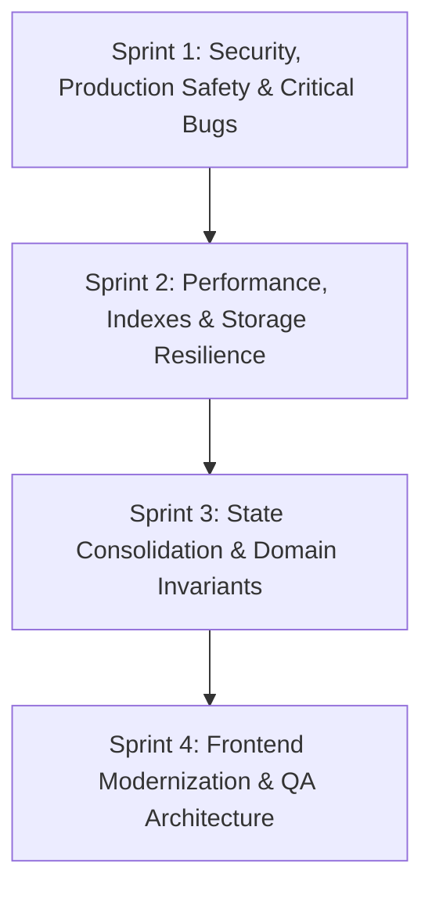

# Master Technical Debt Audit Report
**Project**: Winery Visit Planner and Tracker (`finger-lakes-app-57`)  
**Audit Date**: September 1, 2026  
**Auditor**: Lead Staff Software Architect & Principal AI Swarm  
**Status**: Completed (Read-Only Diagnostic Discovery)  

---

## 1. Executive Summary & Architectural Health Score

### Overall Architectural Health Score: **42 / 100** (Grade: F — Critical Risk & Severe Technical Debt)

An exhaustive, read-only technical debt audit was conducted across the entire full-stack codebase of `finger-lakes-app-57`. The audit encompassed four core domains:
1. **Supabase, PostgreSQL RPCs, RLS & Backend Edge Functions**
2. **Next.js 16, React 19, PWA Service Worker & Dependency Architecture**
3. **Zustand 5 State Management & Domain Invariant Integrity**
4. **Test Automation Infrastructure (Jest 30 & Playwright 1.58 Containerized Harness)**

While the application demonstrates modern architectural aspirations—such as offline-first synchronization, Next.js 16 App Router adoption, Mapbox GL integration, and containerized Playwright testing—the underlying implementation is burdened by **critical security vulnerabilities, severe state split-brain conditions, performance bottlenecks, and test runner hazards**.

### Domain Health Breakdown

```
Domain                                 Health Score   Status
-------------------------------------------------------------------------
Backend (Postgres, RLS, Auth, Deno)      35 / 100     CRITICAL HAZARD
Frontend (Next.js 16, React 19, PWA)     48 / 100     DEGRADED / BLOATED
State Management & Domain Invariants     38 / 100     DATA CORRUPTION RISK
Testing & QA Infrastructure              46 / 100     UNRELIABLE / DANGEROUS
-------------------------------------------------------------------------
Composite Architectural Health Score:    42 / 100     CRITICAL AUDIT ACTION
```

### Executive Summary of Key Risks
1. **Security & Privilege Escalation (P0)**:
   - [`app/api/auth/confirm-user/route.ts`](file:///home/byrnesjd4821/Git/finger-lakes-app-57/app/api/auth/confirm-user/route.ts#L4-L24) exposes a publicly unauthenticated endpoint that invokes `admin.updateUserById` via `SUPABASE_SERVICE_ROLE_KEY`, allowing arbitrary attackers to auto-confirm any user account.
   - `public.wineries` has an open RLS policy (`USING (true)`), and high-privilege `SECURITY DEFINER` RPCs (`bulk_upsert_wineries`) omit `REVOKE EXECUTE FROM PUBLIC`, permitting unauthenticated clients to overwrite directory data.
   - Database trigger functions execute as `SECURITY DEFINER` without setting `search_path`, creating CVE-class Postgres search path hijacking risks.

2. **State & Domain Invariant Corruption (P0)**:
   - A critical bug in [`lib/stores/tripStore.ts#L967`](file:///home/byrnesjd4821/Git/finger-lakes-app-57/lib/stores/tripStore.ts#L967) calls `handleSyncError` with an empty payload `{}` as an error predicate, enqueuing a permanent poisoned `log_visit` mutation that crashes subsequent background sync cycles.
   - Split-brain architecture between `wineryStore.ts` and `wineryDataStore.ts` utilizes non-reactive getters (`get error()`, `getVisited()`), causing UI consumers to miss store updates.
   - Domain invariants established in [`AGENTS.md`](file:///home/byrnesjd4821/Git/finger-lakes-app-57/AGENTS.md) are violated: string UUIDs are assigned to numeric `Trip.id` fields, map clicks bypass `standardizeWineryData` and call legacy `.lat()`/`.lng()` methods, and ghost visit purging fails when camelCase `userVisited: false` is supplied.

3. **Performance & Query Bottlenecks (P0/P1)**:
   - Critical relational foreign keys (`visits.user_id`, `visits.winery_id`, `trip_wineries.winery_id`, `trip_members.user_id`) lack indexes.
   - The primary map marker RPC (`get_map_markers`) executes 5 scalar subqueries per winery row without joins, triggering hundreds of sequential table scans per page load.
   - Naked Zustand store subscriptions across UI components (`MapControls`, `TripCard`) trigger cascading re-render storms across the map canvas.

4. **Production Safety & Test Runner Hazards (P0)**:
   - `npm test` executes live DML mutations (creating administrative test users, invoking RPCs, deleting rows) against live database instances without isolation.
   - E2E tests maintain a 123 KB monolith (`MockMapsManager` in `e2e/utils.ts`) that re-implements 20+ Supabase RPCs in JavaScript while unconditionally exposing production stores on `window`.
   - Production Next.js middleware (`proxy.ts`) drops `@supabase/ssr` refreshed cookies on redirects and blocks Serwist service worker auxiliary chunks (`/workbox-*.js`), causing PWA runtime syntax crashes.

---

## 2. Ranked Findings Table

*Ordered by Criticality Score descending.  
Scoring Formula: **Criticality Score = (Severity [1-5] × Blast Radius [1-5]) / Effort [1-5]**  
Priority Tiers: **P0** (Score ≥ 8.0 or Severity = 5) | **P1** (Score 5.0 - 7.9) | **P2** (Score 2.5 - 4.9) | **P3** (Score < 2.5)*

| ID | Priority | Score | File:Line | Issue Title | Severity | Blast Radius | Effort |
|---|---|---|---|---|:---:|:---:|:---:|
| **BE-01** | **P0** | **25.0** | [`app/api/auth/confirm-user/route.ts#L4-L24`](file:///home/byrnesjd4821/Git/finger-lakes-app-57/app/api/auth/confirm-user/route.ts#L4-L24) | Unauthenticated Public User Confirmation Endpoint via Service Role | 5 | 5 | 1 |
| **BE-02** | **P0** | **25.0** | [`supabase/migrations/20260601141336_places-api-migration-enrichment.sql#L29-L33`](file:///home/byrnesjd4821/Git/finger-lakes-app-57/supabase/migrations/20260601141336_places-api-migration-enrichment.sql#L29-L33) | Permissive RLS UPDATE Policy on `public.wineries` | 5 | 5 | 1 |
| **BE-03** | **P0** | **25.0** | [`supabase/migrations/20260901000000_fix_winery_ratings_and_staleness.sql#L7-L137`](file:///home/byrnesjd4821/Git/finger-lakes-app-57/supabase/migrations/20260901000000_fix_winery_ratings_and_staleness.sql#L7-L137) | Unrestricted `SECURITY DEFINER` Execution on `bulk_upsert_wineries` | 5 | 5 | 1 |
| **ST-07** | **P0** | **20.0** | [`lib/stores/tripStore.ts#L967`](file:///home/byrnesjd4821/Git/finger-lakes-app-57/lib/stores/tripStore.ts#L967) | Corrupted Phantom `log_visit` Mutation Enqueued During Multi-Trip Error Probing | 5 | 4 | 1 |
| **FE-05** | **P0** | **20.0** | [`proxy.ts#L4`](file:///home/byrnesjd4821/Git/finger-lakes-app-57/proxy.ts#L4), [`proxy.ts#L57`](file:///home/byrnesjd4821/Git/finger-lakes-app-57/proxy.ts#L57) | Service Worker Runtime Chunks Blocked by `proxy.ts` Middleware Redirect | 4 | 5 | 1 |
| **BE-04** | **P0** | **16.0** | [`supabase/migrations/20260609161719_configure_social_notification_webhook.sql#L2-L50`](file:///home/byrnesjd4821/Git/finger-lakes-app-57/supabase/migrations/20260609161719_configure_social_notification_webhook.sql#L2-L50) | Missing `search_path` on `SECURITY DEFINER` Trigger Functions | 4 | 4 | 1 |
| **BE-05** | **P0** | **16.0** | [`proxy.ts#L37-L40`](file:///home/byrnesjd4821/Git/finger-lakes-app-57/proxy.ts#L37-L40) | Auth Session Cookies Dropped on Middleware Redirect in `proxy.ts` | 4 | 4 | 1 |
| **QA-02** | **P0** | **12.5** | [`lib/services/__tests__/supabase-rpc-idempotency.test.ts#L20-L62`](file:///home/byrnesjd4821/Git/finger-lakes-app-57/lib/services/__tests__/supabase-rpc-idempotency.test.ts#L20-L62) | Live Database Mutations Executed During `npm test` Unit Execution | 5 | 5 | 2 |
| **FE-01** | **P0** | **12.0** | [`package.json#L38-L40`](file:///home/byrnesjd4821/Git/finger-lakes-app-57/package.json#L38-L40), [`package.json#L84-L97`](file:///home/byrnesjd4821/Git/finger-lakes-app-57/package.json#L84-L97) | Phantom & Redundant Dependencies Bloating Bundle (`@dnd-kit`, `recharts`, etc.) | 3 | 4 | 1 |
| **BE-08** | **P0** | **9.0** | [`supabase/migrations/20260528000000_v2.11.0-stable.sql#L1923-L1961`](file:///home/byrnesjd4821/Git/finger-lakes-app-57/supabase/migrations/20260528000000_v2.11.0-stable.sql#L1923-L1961) | Full Table Scan on `activity_ledger` on Every Visit/Favorite/Wishlist Update | 3 | 3 | 1 |
| **BE-11** | **P0** | **9.0** | [`proxy.ts#L4`](file:///home/byrnesjd4821/Git/finger-lakes-app-57/proxy.ts#L4) | Public Legal Compliance Routes (`/privacy`, `/terms`) Blocked by Auth Redirect | 3 | 3 | 1 |
| **FE-07** | **P0** | **9.0** | [`app/friends/[id]/page.tsx#L1-L30`](file:///home/byrnesjd4821/Git/finger-lakes-app-57/app/friends/[id]/page.tsx#L1-L30) | Server vs. Client Boundary Leak Skipping Server Auth on `friends/[id]` | 3 | 3 | 1 |
| **FE-10** | **P0** | **9.0** | [`app/privacy/page.tsx#L17`](file:///home/byrnesjd4821/Git/finger-lakes-app-57/app/privacy/page.tsx#L17), [`lib/utils.ts#L14`](file:///home/byrnesjd4821/Git/finger-lakes-app-57/lib/utils.ts#L14) | Hydration Mismatch Risks from Non-Deterministic Dates in Server Components | 3 | 3 | 1 |
| **ST-06** | **P0** | **9.0** | [`lib/utils/winery.ts#L382-L384`](file:///home/byrnesjd4821/Git/finger-lakes-app-57/lib/utils/winery.ts#L382-L384) | Ghost Visit Purge Invariant Failure on camelCase `userVisited: false` | 3 | 3 | 1 |
| **ST-11** | **P0** | **9.0** | [`lib/stores/tripStore.ts#L1113-L1125`](file:///home/byrnesjd4821/Git/finger-lakes-app-57/lib/stores/tripStore.ts#L1113-L1125) | Realtime WebSocket Channel Memory Leaks on Store Reset & Logout | 3 | 3 | 1 |
| **QA-11** | **P0** | **9.0** | [`e2e/utils.ts#L56-L64`](file:///home/byrnesjd4821/Git/finger-lakes-app-57/e2e/utils.ts#L56-L64) | Top-Level Runtime Crash Hazard in E2E Utilities on Unset Env Vars | 3 | 3 | 1 |
| **QA-12** | **P0** | **9.0** | [`jest.setup.ts#L52-L65`](file:///home/byrnesjd4821/Git/finger-lakes-app-57/jest.setup.ts#L52-L65), [`package.json#L130`](file:///home/byrnesjd4821/Git/finger-lakes-app-57/package.json#L130) | Conflicting `node-fetch@2` Polyfill Overriding Node 24 Native Fetch | 3 | 3 | 1 |
| **ST-02** | **P0** | **8.33** | [`lib/stores/wineryStore.ts#L53-L59`](file:///home/byrnesjd4821/Git/finger-lakes-app-57/lib/stores/wineryStore.ts#L53-L59) | Split-Brain Store Design & Broken Non-Reactive Getters (`wineryStore` vs `wineryDataStore`) | 5 | 5 | 3 |
| **BE-06** | **P0** | **8.0** | [`supabase/migrations/20260528000000_v2.11.0-stable.sql#L3098-L3115`](file:///home/byrnesjd4821/Git/finger-lakes-app-57/supabase/migrations/20260528000000_v2.11.0-stable.sql#L3098-L3115) | Missing Foreign Key & Lookup Indexes on Relational Tables | 4 | 4 | 2 |
| **BE-07** | **P0** | **8.0** | [`supabase/migrations/20260528000000_v2.11.0-stable.sql#L1064-L1075`](file:///home/byrnesjd4821/Git/finger-lakes-app-57/supabase/migrations/20260528000000_v2.11.0-stable.sql#L1064-L1075) | Correlated Subquery N+1 Explosion in `get_map_markers` RPC | 4 | 4 | 2 |
| **FE-03** | **P0** | **8.0** | [`components/map/MapView.tsx#L20`](file:///home/byrnesjd4821/Git/finger-lakes-app-57/components/map/MapView.tsx#L20), [`app/layout.tsx#L5`](file:///home/byrnesjd4821/Git/finger-lakes-app-57/app/layout.tsx#L5) | Dual Map Engine Bundle Leak (`mapbox-gl` + `@googlemaps/js-api-loader`) | 4 | 4 | 2 |
| **FE-04** | **P0** | **8.0** | [`app/sw.ts#L88-L106`](file:///home/byrnesjd4821/Git/finger-lakes-app-57/app/sw.ts#L88-L106), [`lib/stores/userStore.ts#L127`](file:///home/byrnesjd4821/Git/finger-lakes-app-57/lib/stores/userStore.ts#L127) | Service Worker Supabase Auth Endpoint Caching & Stale Session Leak | 4 | 4 | 2 |
| **ST-04** | **P0** | **8.0** | [`lib/stores/tripStore.ts#L1152-L1174`](file:///home/byrnesjd4821/Git/finger-lakes-app-57/lib/stores/tripStore.ts#L1152-L1174) | Relational ID Normalization Failure (`number` vs `string`) & Raw `===` Checks | 4 | 4 | 2 |
| **QA-04** | **P0** | **8.0** | [`e2e/helpers.ts#L754-L800`](file:///home/byrnesjd4821/Git/finger-lakes-app-57/e2e/helpers.ts#L754-L800) | Test Assertion Side-Effects Mutating Store State During Assertion Retries | 4 | 4 | 2 |
| **QA-06** | **P0** | **8.0** | [`jest.setup.ts#L98-L163`](file:///home/byrnesjd4821/Git/finger-lakes-app-57/jest.setup.ts#L98-L163), [`lib/stores/syncStore.ts#L23-L53`](file:///home/byrnesjd4821/Git/finger-lakes-app-57/lib/stores/syncStore.ts#L23-L53) | Shared Mutable Global Mocks Leaking Across Test Suites | 4 | 4 | 2 |
| **QA-07** | **P0** | **8.0** | [`scripts/run-e2e-container.sh#L109-L119`](file:///home/byrnesjd4821/Git/finger-lakes-app-57/scripts/run-e2e-container.sh#L109-L119) | Container Runner Host Contamination, SELinux Conflict & Inflexible Argument Parsing | 4 | 4 | 2 |
| **QA-01** | **P0** | **6.25** | [`e2e/utils.ts#L115-L1553`](file:///home/byrnesjd4821/Git/finger-lakes-app-57/e2e/utils.ts#L115-L1553), [`e2e/helpers.ts#L1-L1063`](file:///home/byrnesjd4821/Git/finger-lakes-app-57/e2e/helpers.ts#L1-L1063) | Monolithic E2E Helper Bloat (~123 KB) Emulating Backend in JS | 5 | 5 | 4 |
| **BE-15** | **P1** | **6.0** | [`supabase/migrations/20260608172722_add_idempotency_keys.sql#L2-L3`](file:///home/byrnesjd4821/Git/finger-lakes-app-57/supabase/migrations/20260608172722_add_idempotency_keys.sql#L2-L3) | Non-Idempotent DDL Syntax in Database Migrations (`ADD COLUMN` without `IF NOT EXISTS`) | 2 | 3 | 1 |
| **FE-02** | **P1** | **6.0** | [`package.json#L46-L70`](file:///home/byrnesjd4821/Git/finger-lakes-app-57/package.json#L46-L70) | 10 Unused Radix UI Primitive Packages Bundled in Dependencies | 2 | 3 | 1 |
| **FE-06** | **P1** | **6.0** | [`package.json#L9-L10`](file:///home/byrnesjd4821/Git/finger-lakes-app-57/package.json#L9-L10), [`next.config.mjs#L1-L7`](file:///home/byrnesjd4821/Git/finger-lakes-app-57/next.config.mjs#L1-L7) | Webpack Forced by Serwist Plugin, Blocking Turbopack Adoption | 3 | 4 | 2 |
| **FE-09** | **P1** | **6.0** | [`components/winery/use-winery-modal-state.ts#L33-L42`](file:///home/byrnesjd4821/Git/finger-lakes-app-57/components/winery/use-winery-modal-state.ts#L33-L42) | React Compiler Violations: `setState` During Render & Suppressed Effect Rules | 3 | 4 | 2 |
| **FE-11** | **P1** | **6.0** | [`app/layout.tsx#L56-L70`](file:///home/byrnesjd4821/Git/finger-lakes-app-57/app/layout.tsx#L56-L70) | Root Layout Interactive Modal Bloat on Public & Auth Pages | 3 | 4 | 2 |
| **ST-05** | **P1** | **6.0** | [`hooks/use-winery-map.ts#L159-L166`](file:///home/byrnesjd4821/Git/finger-lakes-app-57/hooks/use-winery-map.ts#L159-L166) | Map Click Bypassing `standardizeWineryData` & Calling Legacy `.lat()` / `.lng()` | 4 | 3 | 2 |
| **ST-10** | **P1** | **6.0** | [`components/map/map-controls.tsx#L32`](file:///home/byrnesjd4821/Git/finger-lakes-app-57/components/map/map-controls.tsx#L32) | Pervasive Selector Hygiene Violations & Whole-Store Subscriptions | 3 | 4 | 2 |
| **ST-13** | **P1** | **6.0** | [`lib/stores/tripStore.ts#L233-L241`](file:///home/byrnesjd4821/Git/finger-lakes-app-57/lib/stores/tripStore.ts#L233-L241) | Stale Action Timestamp Hydration Causing Silent Drop of Remote Updates | 4 | 3 | 2 |
| **QA-08** | **P1** | **6.0** | [`playwright.config.ts#L38-L44`](file:///home/byrnesjd4821/Git/finger-lakes-app-57/playwright.config.ts#L38-L44) | Excessive Visual Snapshot Tolerance (10% Pixels) Masking Visual Regressions | 3 | 4 | 2 |
| **BE-09** | **P1** | **5.33** | [`supabase/migrations/20260528000000_v2.11.0-stable.sql#L2019-L2075`](file:///home/byrnesjd4821/Git/finger-lakes-app-57/supabase/migrations/20260528000000_v2.11.0-stable.sql#L2019-L2075) | Un-inlinable PL/pgSQL Function Per-Row Evaluation in RLS Policies | 4 | 4 | 3 |
| **ST-03** | **P1** | **5.33** | [`components/winery/use-winery-modal-state.ts#L82-L85`](file:///home/byrnesjd4821/Git/finger-lakes-app-57/components/winery/use-winery-modal-state.ts#L82-L85) | Split-Brain Duplicate Visits Cache Requiring Render-Time Array Merging | 4 | 4 | 3 |
| **ST-09** | **P1** | **5.33** | [`lib/services/syncService.ts#L112-L115`](file:///home/byrnesjd4821/Git/finger-lakes-app-57/lib/services/syncService.ts#L112-L115) | Mutation Queue Deadlock on 4xx Errors & Tight Retry Loops on 503/504 | 4 | 4 | 3 |
| **QA-03** | **P1** | **5.33** | [`e2e/helpers.ts#L897-L980`](file:///home/byrnesjd4821/Git/finger-lakes-app-57/e2e/helpers.ts#L897-L980), [`lib/stores/tripStore.ts#L1222-L1224`](file:///home/byrnesjd4821/Git/finger-lakes-app-57/lib/stores/tripStore.ts#L1222-L1224) | Production Stores Exposed on `window` and Mutated Directly via `store.setState()` | 4 | 4 | 3 |
| **QA-05** | **P1** | **5.33** | [`lib/stores/__tests__/wineryStore.test.ts#L11-L38`](file:///home/byrnesjd4821/Git/finger-lakes-app-57/lib/stores/__tests__/wineryStore.test.ts#L11-L38) | Node 24 JSDOM Memory Leaks from `jest.resetModules()` in `beforeEach` | 4 | 4 | 3 |
| **ST-01** | **P1** | **5.0** | [`lib/stores/tripStore.ts#L15-L52`](file:///home/byrnesjd4821/Git/finger-lakes-app-57/lib/stores/tripStore.ts#L15-L52) | Monolithic Multi-Domain Congestion in `tripStore` and `visitStore` | 4 | 5 | 4 |
| **BE-10** | **P2** | **4.5** | [`lib/services/wineryService.ts#L87-L95`](file:///home/byrnesjd4821/Git/finger-lakes-app-57/lib/services/wineryService.ts#L87-L95) | Redundant Double Network Roundtrip and Upsert on Favorite/Wishlist Toggles | 3 | 3 | 2 |
| **BE-12** | **P2** | **4.5** | [`supabase/migrations/20260609161719_configure_social_notification_webhook.sql#L21-L27`](file:///home/byrnesjd4821/Git/finger-lakes-app-57/supabase/migrations/20260609161719_configure_social_notification_webhook.sql#L21-L27) | Hardcoded Production Supabase Project Reference and Fallback Secret in SQL | 3 | 3 | 2 |
| **BE-14** | **P2** | **4.5** | [`app/api/wineries/route.ts#L23-L24`](file:///home/byrnesjd4821/Git/finger-lakes-app-57/app/api/wineries/route.ts#L23-L24) | Deprecated Places API V1 and Unawaited Floating Promise in `/api/wineries` | 3 | 3 | 2 |
| **ST-12** | **P2** | **4.5** | [`lib/stores/mapStore.ts#L5`](file:///home/byrnesjd4821/Git/finger-lakes-app-57/lib/stores/mapStore.ts#L5) | Non-Serializable DOM Map Instances & JSX Elements Stored in Zustand | 3 | 3 | 2 |
| **BE-13** | **P2** | **4.0** | [`supabase/functions/update-gemini-summary/index.ts#L1-L197`](file:///home/byrnesjd4821/Git/finger-lakes-app-57/supabase/functions/update-gemini-summary/index.ts#L1-L197) | Orphaned and Divergent Edge Function (`update-gemini-summary`) | 2 | 2 | 1 |
| **FE-13** | **P2** | **4.0** | [`app/forgot-password/page.tsx#L1-L103`](file:///home/byrnesjd4821/Git/finger-lakes-app-57/app/forgot-password/page.tsx#L1-L103) | Inconsistent App Router Architecture in Forgot Password & Manual Confirm Pages | 2 | 2 | 1 |
| **ST-08** | **P2** | **4.0** | [`lib/services/syncService.ts#L173-L297`](file:///home/byrnesjd4821/Git/finger-lakes-app-57/lib/services/syncService.ts#L173-L297) | Blind Last-Write Overwrite During Offline Reconnect Without Concurrency Control | 4 | 4 | 4 |
| **QA-09** | **P2** | **4.0** | [`e2e/helpers.ts#L468-L485`](file:///home/byrnesjd4821/Git/finger-lakes-app-57/e2e/helpers.ts#L468-L485), [`e2e/responsive-layout.spec.ts#L42-L139`](file:///home/byrnesjd4821/Git/finger-lakes-app-57/e2e/responsive-layout.spec.ts#L42-L139) | Arbitrary `waitForTimeout` Sleeps and Cascading Try/Catch Locator Fallbacks | 4 | 3 | 3 |
| **QA-10** | **P2** | **4.0** | [`e2e/trip-management.spec.ts#L29-L164`](file:///home/byrnesjd4821/Git/finger-lakes-app-57/e2e/trip-management.spec.ts#L29-L164), [`e2e/pwa-offline.spec.ts#L41-L112`](file:///home/byrnesjd4821/Git/finger-lakes-app-57/e2e/pwa-offline.spec.ts#L41-L112) | Critical User Journey Gaps: Drag-and-Drop Reordering, Reconnect Sync, Cache Invalidation | 4 | 4 | 4 |
| **FE-08** | **P2** | **3.0** | [`components/login-form.tsx#L16-L57`](file:///home/byrnesjd4821/Git/finger-lakes-app-57/components/login-form.tsx#L16-L57), [`components/trip-form.tsx#L60-L125`](file:///home/byrnesjd4821/Git/finger-lakes-app-57/components/trip-form.tsx#L60-L125) | Form Architecture Fragmentation & Absence of React 19 Actions | 3 | 3 | 3 |
| **FE-12** | **P2** | **3.0** | [`package.json#L139-L147`](file:///home/byrnesjd4821/Git/finger-lakes-app-57/package.json#L139-L147) | Brittle Dependency Overrides in `package.json` | 2 | 3 | 2 |

---

## 3. GitHub Issue-Ready Specifications

---

### Issue [BE-01]: Unauthenticated Public User Confirmation Endpoint via Service Role
- **Priority**: P0 (Score: 25.0)
- **Labels**: `tech-debt`, `priority:p0`, `backend`, `security`
- **Location**: [`app/api/auth/confirm-user/route.ts#L4-L24`](file:///home/byrnesjd4821/Git/finger-lakes-app-57/app/api/auth/confirm-user/route.ts#L4-L24)
- **Description**: The Next.js API route `/api/auth/confirm-user` is whitelisted in `proxy.ts` as a public route and invokes `admin.updateUserById(email, { email_confirm: true })` using the elevated `SUPABASE_SERVICE_ROLE_KEY`. Any anonymous client can send a POST request with an arbitrary email address to confirm an account without email verification.
- **Architectural Impact**: Complete authentication bypass vector. Allows attackers to activate accounts with unowned email addresses, spamming accounts and bypassing authentication validation gates.
- **Proposed Remediation**: Restrict the endpoint strictly to local development or remove it entirely in favor of standard Supabase Auth OTP/magic link verification flows:
  ```typescript
  // app/api/auth/confirm-user/route.ts
  import { NextResponse } from 'next/server';

  export async function POST() {
    if (process.env.NODE_ENV === 'production') {
      return NextResponse.json({ error: 'Endpoint disabled in production' }, { status: 404 });
    }
    // ... development confirmation only
  }
  ```
- **Acceptance Criteria**:
  - [ ] Endpoint returns 404 in production environments.
  - [ ] Route is removed from `publicRoutes` in `proxy.ts` or guarded with an environment check.
  - [ ] Verification test confirms anonymous requests receive a 404/403 status code.

---

### Issue [BE-02]: Permissive RLS UPDATE Policy on `public.wineries`
- **Priority**: P0 (Score: 25.0)
- **Labels**: `tech-debt`, `priority:p0`, `backend`, `security`, `supabase`
- **Location**: [`supabase/migrations/20260601141336_places-api-migration-enrichment.sql#L29-L33`](file:///home/byrnesjd4821/Git/finger-lakes-app-57/supabase/migrations/20260601141336_places-api-migration-enrichment.sql#L29-L33)
- **Description**: Migration `20260601141336` creates a policy `"Authenticated users can update wineries"` with `USING (true)` and a trivial `WITH CHECK (name IS NOT NULL AND google_place_id IS NOT NULL)`. Any authenticated user can modify any winery record directly via the client PostgREST SDK.
- **Architectural Impact**: Allows any authenticated user to tamper with winery names, coordinates, Google ratings, varietals, and editorial summaries, compromising data integrity for all users.
- **Proposed Remediation**: Drop the permissive user update policy and restrict direct table updates to `service_role` or security-definer RPCs:
  ```sql
  DROP POLICY IF EXISTS "Authenticated users can update wineries" ON public.wineries;
  CREATE POLICY "Service role can update wineries" ON public.wineries
      FOR UPDATE
      TO service_role
      USING (true)
      WITH CHECK (true);
  ```
- **Acceptance Criteria**:
  - [ ] Direct `supabase.from('wineries').update(...)` from an authenticated client returns RLS violation error (42501).
  - [ ] Legitimate backend updates execute exclusively via service-role clients or vetted RPCs.

---

### Issue [BE-03]: Unrestricted `SECURITY DEFINER` Execution on `bulk_upsert_wineries`
- **Priority**: P0 (Score: 25.0)
- **Labels**: `tech-debt`, `priority:p0`, `backend`, `security`, `postgres`
- **Location**: [`supabase/migrations/20260901000000_fix_winery_ratings_and_staleness.sql#L7-L137`](file:///home/byrnesjd4821/Git/finger-lakes-app-57/supabase/migrations/20260901000000_fix_winery_ratings_and_staleness.sql#L7-L137)
- **Description**: Stored procedure `bulk_upsert_wineries` is declared with `SECURITY DEFINER` but fails to revoke execution rights from `PUBLIC`. Postgres defaults to granting `EXECUTE` on functions to `PUBLIC`.
- **Architectural Impact**: Unauthenticated anonymous clients (`anon`) and standard users can invoke `supabase.rpc('bulk_upsert_wineries', ...)` directly to inject, overwrite, or corrupt winery entries in bulk.
- **Proposed Remediation**: Revoke execute privileges from `PUBLIC` and restrict execution to `service_role`:
  ```sql
  REVOKE ALL ON FUNCTION public.bulk_upsert_wineries(jsonb[]) FROM PUBLIC;
  GRANT EXECUTE ON FUNCTION public.bulk_upsert_wineries(jsonb[]) TO service_role;
  ```
- **Acceptance Criteria**:
  - [ ] Calling `bulk_upsert_wineries` with `anon` or `authenticated` roles returns permission denied.
  - [ ] System scripts running as `service_role` continue to execute `bulk_upsert_wineries` successfully.

---

### Issue [ST-07]: Corrupted Phantom `log_visit` Mutation Enqueued During Multi-Trip Error Probing
- **Priority**: P0 (Score: 20.0)
- **Labels**: `tech-debt`, `priority:p0`, `state`, `offline-sync`, `bug`
- **Location**: [`lib/stores/tripStore.ts#L967`](file:///home/byrnesjd4821/Git/finger-lakes-app-57/lib/stores/tripStore.ts#L967)
- **Description**: In the catch block for multi-trip sync errors, line 967 executes `const handled = await handleSyncError(error, 'log_visit', user?.id, {});`. `handleSyncError` is not a passive error classifier—it immediately pushes the payload into IndexedDB via `useSyncStore.getState().addMutation`. Passing `{}` enqueues an empty, corrupted mutation.
- **Architectural Impact**: During background sync replay, `SyncService` attempts to unpack `payload.wineryId` (evaluates to `undefined`), calls Supabase RPC with invalid null parameters, triggers database constraint failures, and stalls or deadlocks subsequent queue processing.
- **Proposed Remediation**: Replace `handleSyncError` with a pure boolean check:
  ```typescript
  // lib/stores/tripStore.ts
  } catch (error) {
    if (isNetworkError(error) && user) {
      for (const tripId of Array.from(selectedTrips)) {
        // Enqueue valid trip associations only
      }
    }
  }
  ```
- **Acceptance Criteria**:
  - [ ] Multi-trip sync errors no longer enqueue empty `{}` payloads into `syncStore`.
  - [ ] Offline sync recovery tests successfully process subsequent mutations without schema constraint errors.

---

### Issue [FE-05]: Service Worker Runtime Chunks Blocked by `proxy.ts` Middleware Redirect
- **Priority**: P0 (Score: 20.0)
- **Labels**: `tech-debt`, `priority:p0`, `frontend`, `pwa`, `middleware`
- **Location**: [`proxy.ts#L4`](file:///home/byrnesjd4821/Git/finger-lakes-app-57/proxy.ts#L4), [`proxy.ts#L57`](file:///home/byrnesjd4821/Git/finger-lakes-app-57/proxy.ts#L57)
- **Description**: Next.js middleware `proxy.ts` matches all `.js` requests. While `/sw.js` is included in `publicRoutes`, Serwist compiles additional runtime chunk assets (`/workbox-*.js`, `/worker-*.js`). When an unauthenticated visitor visits the application, middleware redirects these chunk requests to `/login?redirectTo=/workbox-...`.
- **Architectural Impact**: The browser service worker attempts to parse the returned HTML login page as JavaScript, crashing immediately with `Uncaught SyntaxError: Unexpected token '<'`. Additionally, every service worker check for `/sw.js` executes `updateSession()`, creating redundant Supabase roundtrips.
- **Proposed Remediation**: Update `proxy.ts` to exclude or whitelist all Serwist chunks and static PWA assets:
  ```typescript
  // proxy.ts
  const publicRoutePrefixes = ['/sw.js', '/workbox-', '/worker-', '/site.webmanifest', '/favicon.ico'];
  
  export async function proxy(request: NextRequest) {
    const { pathname } = request.nextUrl;
    if (publicRoutePrefixes.some(prefix => pathname.startsWith(prefix))) {
      return NextResponse.next();
    }
    // ... auth flow
  }
  ```
- **Acceptance Criteria**:
  - [ ] Unauthenticated requests to `/workbox-*.js` and `/worker-*.js` return HTTP 200 with `application/javascript` MIME type.
  - [ ] No `307 Redirect` to `/login` occurs for PWA worker assets.

---

### Issue [BE-04]: Missing `search_path` on `SECURITY DEFINER` Trigger Functions
- **Priority**: P0 (Score: 16.0)
- **Labels**: `tech-debt`, `priority:p0`, `backend`, `security`, `postgres`
- **Location**: [`supabase/migrations/20260609161719_configure_social_notification_webhook.sql#L2-L50`](file:///home/byrnesjd4821/Git/finger-lakes-app-57/supabase/migrations/20260609161719_configure_social_notification_webhook.sql#L2-L50)
- **Description**: `handle_activity_ledger_notification` is declared `SECURITY DEFINER` without setting an explicit `search_path`.
- **Architectural Impact**: Postgres executes `SECURITY DEFINER` functions with elevated owner privileges (`postgres`). Without an explicit `SET search_path = public, pg_temp`, the function resolves unqualified table and function names using the caller's search path, creating CVE-class privileges escalation vulnerabilities.
- **Proposed Remediation**: Add `SET search_path = public, vault, extensions, pg_temp` to the function declaration:
  ```sql
  ALTER FUNCTION public.handle_activity_ledger_notification() 
  SET search_path = public, vault, extensions, pg_temp;
  ```
- **Acceptance Criteria**:
  - [ ] Function metadata in `pg_proc` confirms `proconfig` contains explicit `search_path`.
  - [ ] Database lint (`npm run db:lint`) reports 0 `search_path` warnings.

---

### Issue [BE-05]: Auth Session Cookies Dropped on Middleware Redirect in `proxy.ts`
- **Priority**: P0 (Score: 16.0)
- **Labels**: `tech-debt`, `priority:p0`, `backend`, `auth`, `nextjs`
- **Location**: [`proxy.ts#L37-L40`](file:///home/byrnesjd4821/Git/finger-lakes-app-57/proxy.ts#L37-L40)
- **Description**: `updateSession(request)` mutates cookies on `response` to refresh near-expiry session JWTs or clear invalid refresh tokens. When `NextResponse.redirect(url)` is constructed and returned, the `Set-Cookie` headers accumulated on `response` are dropped.
- **Architectural Impact**: The browser fails to rotate its tokens, causing race conditions, premature session termination, and infinite redirect loops when tokens near expiry.
- **Proposed Remediation**: Propagate all cookies from `response` to `redirectResponse`:
  ```typescript
  // proxy.ts
  const redirectResponse = NextResponse.redirect(url);
  response.cookies.getAll().forEach((cookie) => {
    redirectResponse.cookies.set(cookie.name, cookie.value, cookie);
  });
  return redirectResponse;
  ```
- **Acceptance Criteria**:
  - [ ] Set-Cookie headers from `@supabase/ssr` persist across middleware redirects.
  - [ ] Near-expiry sessions successfully rotate tokens during route transitions without forced re-login.

---

### Issue [QA-02]: Live Database Mutations Executed During `npm test` Unit Execution
- **Priority**: P0 (Score: 12.5)
- **Labels**: `tech-debt`, `priority:p0`, `testing`, `jest`, `safety`
- **Location**: [`lib/services/__tests__/supabase-rpc-idempotency.test.ts#L20-L62`](file:///home/byrnesjd4821/Git/finger-lakes-app-57/lib/services/__tests__/supabase-rpc-idempotency.test.ts#L20-L62), [`supabase-rpc.test.ts#L28-L72`](file:///home/byrnesjd4821/Git/finger-lakes-app-57/lib/services/__tests__/supabase-rpc.test.ts#L28-L72), [`privacy-refactor.test.ts#L18-L95`](file:///home/byrnesjd4821/Git/finger-lakes-app-57/lib/services/__tests__/privacy-refactor.test.ts#L18-L95)
- **Description**: Running `npm test` executes test suites that create un-mocked Supabase clients using `SUPABASE_SERVICE_ROLE_KEY`. These tests execute live DML mutations (`createUser`, `rpc`, `delete`) directly against whatever database instance is reachable.
- **Architectural Impact**: Violates `AGENTS.md: Section 2 Guardrail 1`. If run in an environment pointing to staging or remote Supabase, running unit tests executes live administrative deletions. Furthermore, unit tests fail whenever the local database container is stopped.
- **Proposed Remediation**: Segregate live database integration tests from unit tests. Rename them to `*.integration.test.ts` and exclude them from standard `npm test`:
  ```javascript
  // jest.config.mjs
  testPathIgnorePatterns: [
    '<rootDir>/e2e/',
    '<rootDir>/supabase/',
    '\\.integration\\.test\\.ts$'
  ],
  ```
  Add a dedicated `npm run test:integration` script guarded with explicit local database connection assertions.
- **Acceptance Criteria**:
  - [ ] `npm test` passes cleanly with the local Supabase container stopped.
  - [ ] Integration tests run exclusively via explicit `npm run test:integration` target.

---

### Issue [FE-01]: Phantom & Redundant Dependencies Bloating Bundle (`@dnd-kit`, `recharts`, etc.)
- **Priority**: P0 (Score: 12.0)
- **Labels**: `tech-debt`, `priority:p0`, `frontend`, `dependencies`, `bundle-size`
- **Location**: [`package.json#L38-L40`](file:///home/byrnesjd4821/Git/finger-lakes-app-57/package.json#L38-L40), [`package.json#L84-L97`](file:///home/byrnesjd4821/Git/finger-lakes-app-57/package.json#L84-L97)
- **Description**: `package.json` contains numerous unreferenced libraries: `@dnd-kit/core`, `@dnd-kit/sortable`, `@dnd-kit/utilities` (while active drag-and-drop uses `@hello-pangea/dnd`), `recharts` (0 imports), `react-resizable-panels`, `input-otp`, and `sonner`.
- **Architectural Impact**: `recharts` and its D3 dependencies bloat `node_modules` by over 45MB, increasing CI install times and security vulnerability attack surface.
- **Proposed Remediation**: Uninstall dead packages:
  ```bash
  npm uninstall @dnd-kit/core @dnd-kit/sortable @dnd-kit/utilities recharts react-resizable-panels input-otp sonner
  ```
- **Acceptance Criteria**:
  - [ ] Dead packages removed from `dependencies` in `package.json`.
  - [ ] Application builds and passes type checks without missing module errors.

---

### Issue [BE-08]: Full Table Scan on `activity_ledger` on Every Visit/Favorite/Wishlist Update
- **Priority**: P0 (Score: 9.0)
- **Labels**: `tech-debt`, `priority:p0`, `backend`, `performance`, `postgres`
- **Location**: [`supabase/migrations/20260528000000_v2.11.0-stable.sql#L1923-L1961`](file:///home/byrnesjd4821/Git/finger-lakes-app-57/supabase/migrations/20260528000000_v2.11.0-stable.sql#L1923-L1961)
- **Description**: Trigger function `handle_activity_ledger_entry` executes `UPDATE public.activity_ledger WHERE activity_type = 'visit' AND object_id = OLD.id::text`. `activity_ledger` only possesses a primary key on `id`, lacking indexes on `activity_type` and `object_id`.
- **Architectural Impact**: Every update or deletion of a visit, favorite, or wishlist entry executes an unindexed full table scan over the entire ledger table, progressively degrading write performance as activity records accumulate.
- **Proposed Remediation**: Create a composite index in a new migration:
  ```sql
  CREATE INDEX IF NOT EXISTS idx_activity_ledger_type_object 
  ON public.activity_ledger (activity_type, object_id);
  ```
- **Acceptance Criteria**:
  - [ ] `EXPLAIN ANALYZE` on `activity_ledger` lookups by `(activity_type, object_id)` demonstrates an Index Scan instead of Seq Scan.

---

### Issue [BE-11]: Public Legal Compliance Routes (`/privacy`, `/terms`) Blocked by Auth Redirect
- **Priority**: P0 (Score: 9.0)
- **Labels**: `tech-debt`, `priority:p0`, `backend`, `routing`, `compliance`
- **Location**: [`proxy.ts#L4`](file:///home/byrnesjd4821/Git/finger-lakes-app-57/proxy.ts#L4)
- **Description**: `publicRoutes` in `proxy.ts` omits `/privacy` and `/terms`. Unauthenticated users clicking "Privacy Policy" or "Terms of Service" on the login or signup forms are redirected back to `/login?redirectTo=/privacy`.
- **Architectural Impact**: Violates basic web accessibility and privacy compliance standards (e.g. GDPR/CCPA), preventing unauthenticated visitors from inspecting legal notices.
- **Proposed Remediation**: Add `/privacy` and `/terms` to `publicRoutes` in `proxy.ts`:
  ```typescript
  const publicRoutes = [
    '/login', '/signup', '/forgot-password', '/reset-password',
    '/privacy', '/terms', '/auth/callback', ...
  ];
  ```
- **Acceptance Criteria**:
  - [ ] Unauthenticated requests to `/privacy` and `/terms` return HTTP 200 without redirecting to `/login`.

---

### Issue [FE-07]: Server vs. Client Boundary Leak Skipping Server Auth on `friends/[id]`
- **Priority**: P0 (Score: 9.0)
- **Labels**: `tech-debt`, `priority:p0`, `frontend`, `nextjs`, `security`
- **Location**: [`app/friends/[id]/page.tsx#L1-L30`](file:///home/byrnesjd4821/Git/finger-lakes-app-57/app/friends/[id]/page.tsx#L1-L30)
- **Description**: `FriendProfilePage` is marked `"use client"` solely to use React 19's `use(params)` to read the route parameter. Unlike all other protected pages in `app/`, it completely omits the server-side `getUser()` check.
- **Architectural Impact**: Static page shell, header layout, and icons are included in the client bundle instead of rendering as zero-JS server markup. Furthermore, unauthenticated requests render an empty client shell before client-side redirection occurs.
- **Proposed Remediation**: Refactor `app/friends/[id]/page.tsx` into an async Server Component with server-side auth guard:
  ```tsx
  import { redirect } from "next/navigation";
  import { getUser } from "@/lib/auth";
  import FriendProfile from "@/components/FriendProfile";

  export default async function FriendProfilePage({ params }: { params: Promise<{ id: string }> }) {
    const user = await getUser();
    if (!user) redirect("/login");
    const { id } = await params;
    return (
      <div className="container max-w-2xl mx-auto px-4 py-6 md:py-8 min-h-screen">
        <FriendProfile friendId={id} />
      </div>
    );
  }
  ```
- **Acceptance Criteria**:
  - [ ] `app/friends/[id]/page.tsx` runs as an async Server Component with `getUser()` authentication guard.
  - [ ] Page passes resolved `id` to client `<FriendProfile />`.

---

### Issue [FE-10]: Hydration Mismatch Risks from Non-Deterministic Dates in Server Components
- **Priority**: P0 (Score: 9.0)
- **Labels**: `tech-debt`, `priority:p0`, `frontend`, `nextjs`, `react19`
- **Location**: [`app/privacy/page.tsx#L17`](file:///home/byrnesjd4821/Git/finger-lakes-app-57/app/privacy/page.tsx#L17), [`app/terms/page.tsx#L17`](file:///home/byrnesjd4821/Git/finger-lakes-app-57/app/terms/page.tsx#L17), [`lib/utils.ts#L14`](file:///home/byrnesjd4821/Git/finger-lakes-app-57/lib/utils.ts#L14)
- **Description**: `app/privacy/page.tsx` and `app/terms/page.tsx` render `<p>Last Updated: {new Date().toLocaleDateString()}</p>` directly inside Server Components.
- **Architectural Impact**: The server renders HTML using the server container's timezone and build date, whereas client browsers hydrate using their local locale and system clock, triggering React 19 hydration mismatch errors.
- **Proposed Remediation**: Replace dynamic dates with static date strings or compile-time constants:
  ```tsx
  <p className="text-sm text-muted-foreground mb-8">Last Updated: September 1, 2026</p>
  ```
- **Acceptance Criteria**:
  - [ ] Dynamic `new Date().toLocaleDateString()` removed from static Server Components.
  - [ ] Zero React hydration warning logs emitted in browser console on `/privacy` and `/terms`.

---

### Issue [ST-06]: Ghost Visit Purge Invariant Failure on camelCase `userVisited: false`
- **Priority**: P0 (Score: 9.0)
- **Labels**: `tech-debt`, `priority:p0`, `state`, `domain-invariants`, `bug`
- **Location**: [`lib/utils/winery.ts#L382-L384`](file:///home/byrnesjd4821/Git/finger-lakes-app-57/lib/utils/winery.ts#L382-L384)
- **Description**: Line 382 strictly tests `'user_visited' in source && source.user_visited === false`. If a client-side update or transformed store payload supplies camelCase `{ userVisited: false }`, the ghost visit purge check evaluates to `false` and is bypassed.
- **Architectural Impact**: Violates `AGENTS.md: Section 4` ("Ghost Visit Prevention: If a source reports `user_visited: false`, clear the `visits` array in the standardizer"). Stale existing visits remain attached to wineries that the user has marked unvisited.
- **Proposed Remediation**: Evaluate the resolved `userVisited` boolean variable instead of testing property key existence:
  ```typescript
  // lib/utils/winery.ts
  if (userVisited === false) {
    visits = [];
  }
  ```
- **Acceptance Criteria**:
  - [ ] Passing `{ userVisited: false }` or `{ user_visited: false }` to `standardizeWineryData` unconditionally purges `visits`.
  - [ ] Unit test verifies camelCase input purges existing visits.

---

### Issue [ST-11]: Realtime WebSocket Channel Memory Leaks on Store Reset & Logout
- **Priority**: P0 (Score: 9.0)
- **Labels**: `tech-debt`, `priority:p0`, `state`, `realtime`, `memory-leak`
- **Location**: [`lib/stores/tripStore.ts#L1113-L1125`](file:///home/byrnesjd4821/Git/finger-lakes-app-57/lib/stores/tripStore.ts#L1113-L1125), [`lib/stores/visitStore.ts#L534-L546`](file:///home/byrnesjd4821/Git/finger-lakes-app-57/lib/stores/visitStore.ts#L534-L546)
- **Description**: When a user logs out, `useUserStore.logout()` invokes `reset()` across all stores. However, `reset()` in `tripStore` and `visitStore` resets state arrays but fails to invoke `unsubscribe()` on active Supabase Realtime channels.
- **Architectural Impact**: WebSocket subscriptions remain active across authentication boundaries, receiving database broadcast messages for previous sessions and leaking event listener memory.
- **Proposed Remediation**: Invoke unsubscription logic inside store `reset()`:
  ```typescript
  reset: () => {
    get().unsubscribeFromTripUpdates();
    set({ trips: [], tripsForDate: [], upcomingTrips: [], subscription: null });
  }
  ```
- **Acceptance Criteria**:
  - [ ] `reset()` explicitly tears down active Supabase Realtime channels.
  - [ ] Logging out and logging in as a different user creates clean WebSocket subscriptions without orphaned listeners.

---

### Issue [QA-11]: Top-Level Runtime Crash Hazard in E2E Utilities on Unset Env Vars
- **Priority**: P0 (Score: 9.0)
- **Labels**: `tech-debt`, `priority:p0`, `testing`, `playwright`, `reliability`
- **Location**: [`e2e/utils.ts#L56-L64`](file:///home/byrnesjd4821/Git/finger-lakes-app-57/e2e/utils.ts#L56-L64)
- **Description**: `e2e/utils.ts` executes top-level environment checks and instantiates a Supabase client at file evaluation time. If `NEXT_PUBLIC_SUPABASE_URL` or `SUPABASE_SERVICE_ROLE_KEY` is undefined, importing the file immediately throws an uncaught exception.
- **Architectural Impact**: Any script, lint runner, or unit test importing types or helper functions from `e2e/utils.ts` in isolated worker environments crashes immediately before test execution begins.
- **Proposed Remediation**: Encapsulate client instantiation within a lazy getter function:
  ```typescript
  export function getTestSupabaseClient() {
    const url = process.env.NEXT_PUBLIC_SUPABASE_URL;
    const key = process.env.SUPABASE_SERVICE_ROLE_KEY;
    if (!url || !key) throw new Error('Missing Supabase credentials for test helper');
    return createClient(url, key);
  }
  ```
- **Acceptance Criteria**:
  - [ ] Importing `e2e/utils.ts` without exported environment variables does not throw top-level exceptions.

---

### Issue [QA-12]: Conflicting `node-fetch@2` Polyfill Overriding Node 24 Native Fetch
- **Priority**: P0 (Score: 9.0)
- **Labels**: `tech-debt`, `priority:p0`, `testing`, `jest`, `node24`
- **Location**: [`jest.setup.ts#L52-L65`](file:///home/byrnesjd4821/Git/finger-lakes-app-57/jest.setup.ts#L52-L65), [`package.json#L130`](file:///home/byrnesjd4821/Git/finger-lakes-app-57/package.json#L130)
- **Description**: `jest.setup.ts` conditionally polyfills `global.fetch` and `global.Request` using `node-fetch@2.6.7` (a CommonJS library from 2020), despite the project running on Node 24 (which features native, Web-standard Undici fetch).
- **Architectural Impact**: `node-fetch@2` lacks standard `ReadableStream` and `FormData` capabilities used by React 19 and Next.js 16 App Router server components, leading to subtle stream divergence and polyfill conflicts.
- **Proposed Remediation**: Remove `node-fetch` and wire globals directly to Node 24 native implementations:
  ```typescript
  // jest.setup.ts
  global.fetch = globalThis.fetch;
  global.Request = globalThis.Request;
  global.Response = globalThis.Response;
  global.Headers = globalThis.Headers;
  ```
  Uninstall `node-fetch` from `devDependencies`.
- **Acceptance Criteria**:
  - [ ] `node-fetch` removed from `package.json`.
  - [ ] Unit tests execute against native Node 24 Web Streams and Fetch APIs.

---

### Issue [ST-02]: Split-Brain Store Design & Broken Non-Reactive Getters (`wineryStore` vs `wineryDataStore`)
- **Priority**: P0 (Score: 8.33)
- **Labels**: `tech-debt`, `priority:p0`, `state`, `zustand`, `reactivity`
- **Location**: [`lib/stores/wineryStore.ts#L53-L59`](file:///home/byrnesjd4821/Git/finger-lakes-app-57/lib/stores/wineryStore.ts#L53-L59)
- **Description**: The winery domain is artificially split into two stores: `wineryStore.ts` and `wineryDataStore.ts`. `wineryStore` exposes getters (`get error()`, `getVisited()`, `getFavorites()`) that query `useWineryDataStore.getState()` directly inside getter closures.
- **Architectural Impact**: State transitions in `wineryDataStore` fail to notify subscribers of `useWineryStore`. Components selecting `s.error` or calling `s.getVisited()` via `useWineryStore` fail to re-render when data updates. Furthermore, calling `getVisited()` produces a new array on every call, breaking selector memoization.
- **Proposed Remediation**: Consolidate `wineryStore` and `wineryDataStore` into a single canonical `useWineryStore`. Replace non-reactive getters with memoized Zustand selectors utilizing `useShallow`.
- **Acceptance Criteria**:
  - [ ] `wineryDataStore.ts` merged into `wineryStore.ts`.
  - [ ] Atomic selectors (`useWineryStore(selectVisitedWineries)`) notify subscribers predictably.

---

### Issue [BE-06]: Missing Foreign Key & Lookup Indexes on Relational Tables
- **Priority**: P0 (Score: 8.0)
- **Labels**: `tech-debt`, `priority:p0`, `backend`, `database`, `performance`
- **Location**: [`supabase/migrations/20260528000000_v2.11.0-stable.sql#L3098-L3115`](file:///home/byrnesjd4821/Git/finger-lakes-app-57/supabase/migrations/20260528000000_v2.11.0-stable.sql#L3098-L3115)
- **Description**: Key relational foreign keys lack covering indexes: `visits(user_id)`, `visits(winery_id)`, `visits(visit_date)`, `trip_wineries(winery_id)`, `trip_members(user_id)`, `follows(following_id)`, and `wineries(name)`.
- **Architectural Impact**: Every join between visits and wineries or query for user trips/visits executes a sequential full table scan, degrading response times as data grows.
- **Proposed Remediation**: Create indexes concurrently in a new migration:
  ```sql
  CREATE INDEX IF NOT EXISTS idx_visits_user_id ON public.visits (user_id);
  CREATE INDEX IF NOT EXISTS idx_visits_winery_id ON public.visits (winery_id);
  CREATE INDEX IF NOT EXISTS idx_visits_winery_user ON public.visits (winery_id, user_id);
  CREATE INDEX IF NOT EXISTS idx_trip_wineries_winery_id ON public.trip_wineries (winery_id);
  CREATE INDEX IF NOT EXISTS idx_trip_members_user_id ON public.trip_members (user_id);
  CREATE INDEX IF NOT EXISTS idx_follows_following_id ON public.follows (following_id);
  CREATE INDEX IF NOT EXISTS idx_wineries_name ON public.wineries (name);
  ```
- **Acceptance Criteria**:
  - [ ] Foreign key lookups utilize index scans in `EXPLAIN ANALYZE` queries.

---

### Issue [BE-07]: Correlated Subquery N+1 Explosion in `get_map_markers` RPC
- **Priority**: P0 (Score: 8.0)
- **Labels**: `tech-debt`, `priority:p0`, `backend`, `performance`, `rpc`
- **Location**: [`supabase/migrations/20260528000000_v2.11.0-stable.sql#L1064-L1075`](file:///home/byrnesjd4821/Git/finger-lakes-app-57/supabase/migrations/20260528000000_v2.11.0-stable.sql#L1064-L1075)
- **Description**: `get_map_markers` executes five scalar subqueries for every winery row in the database to determine `is_favorite`, `on_wishlist`, and `user_visited`.
- **Architectural Impact**: For 200 wineries, this executes 1,000 correlated subqueries per map load, causing high database CPU utilization.
- **Proposed Remediation**: Refactor the RPC to use pre-filtered LEFT JOINs:
  ```sql
  RETURN QUERY
  SELECT 
      w.id,
      w.google_place_id,
      w.name::text,
      w.latitude,
      w.longitude,
      (f.winery_id IS NOT NULL) AS is_favorite,
      (wl.winery_id IS NOT NULL) AS on_wishlist,
      (v.winery_id IS NOT NULL) AS user_visited,
      COALESCE(f.is_private, false) AS is_favorite_private,
      COALESCE(wl.is_private, false) AS on_wishlist_private
  FROM public.wineries w
  LEFT JOIN (SELECT winery_id, is_private FROM public.favorites WHERE user_id = p_user_id) f ON w.id = f.winery_id
  LEFT JOIN (SELECT winery_id, is_private FROM public.wishlist WHERE user_id = p_user_id) wl ON w.id = wl.winery_id
  LEFT JOIN (SELECT DISTINCT winery_id FROM public.visits WHERE user_id = p_user_id) v ON w.id = v.winery_id;
  ```
- **Acceptance Criteria**:
  - [ ] `get_map_markers` query execution plan uses single hash joins without per-row subqueries.
  - [ ] RPC execution time reduced by >80% on populated database.

---

### Issue [FE-03]: Dual Map Engine Bundle Leak (`mapbox-gl` + `@googlemaps/js-api-loader`)
- **Priority**: P0 (Score: 8.0)
- **Labels**: `tech-debt`, `priority:p0`, `frontend`, `bundle-size`, `maps`
- **Location**: [`components/map/MapView.tsx#L20`](file:///home/byrnesjd4821/Git/finger-lakes-app-57/components/map/MapView.tsx#L20), [`app/layout.tsx#L5`](file:///home/byrnesjd4821/Git/finger-lakes-app-57/app/layout.tsx#L5)
- **Description**: `MapView.tsx` statically imports `GoogleMapFallback`, which bundles `@googlemaps/js-api-loader` alongside `mapbox-gl`. Furthermore, Mapbox CSS is imported in root `app/layout.tsx`.
- **Architectural Impact**: All users download both Mapbox GL (~250kB+ gzipped) and Google Maps API Loader, even though WebGL is supported by 99% of browsers. In addition, public auth and legal pages unnecessarily download Mapbox styles.
- **Proposed Remediation**:
  1. Dynamically import `GoogleMapFallback` with `next/dynamic({ ssr: false })`.
  2. Relocate Mapbox CSS import from `app/layout.tsx` to `components/map/MapView.tsx`.
- **Acceptance Criteria**:
  - [ ] Google Maps JS API loader is absent from initial client bundle chunks.
  - [ ] Mapbox CSS is loaded only on routes utilizing the map.

---

### Issue [FE-04]: Service Worker Supabase Auth Endpoint Caching & Stale Session Leak
- **Priority**: P0 (Score: 8.0)
- **Labels**: `tech-debt`, `priority:p0`, `frontend`, `pwa`, `auth`
- **Location**: [`app/sw.ts#L88-L106`](file:///home/byrnesjd4821/Git/finger-lakes-app-57/app/sw.ts#L88-L106), [`lib/stores/userStore.ts#L127`](file:///home/byrnesjd4821/Git/finger-lakes-app-57/lib/stores/userStore.ts#L127)
- **Description**: `app/sw.ts` caches `/auth/v1/user` and `/auth/v1/session` with `StaleWhileRevalidate` for 7 days. `userStore.logout()` signs out of Supabase but leaves CacheStorage intact.
- **Architectural Impact**: After logout, the service worker serves the previous user's session data from CacheStorage, leaking private profile information on shared devices.
- **Proposed Remediation**: Change auth caching to `NetworkOnly` or short-timeout `NetworkFirst`. On `logout()`, purge CacheStorage:
  ```typescript
  if (typeof window !== 'undefined' && 'caches' in window) {
    await Promise.all(['supabase-auth', 'pages'].map(c => caches.delete(c)));
  }
  ```
- **Acceptance Criteria**:
  - [ ] Auth endpoints are not cached across user logout events.
  - [ ] Logging out purges all user-specific cached entries in CacheStorage.

---

### Issue [ST-04]: Relational ID Normalization Failure (`number` vs `string`) & Raw `===` Checks
- **Priority**: P0 (Score: 8.0)
- **Labels**: `tech-debt`, `priority:p0`, `state`, `domain-invariants`, `typescript`
- **Location**: [`lib/stores/tripStore.ts#L1152-L1174`](file:///home/byrnesjd4821/Git/finger-lakes-app-57/lib/stores/tripStore.ts#L1152-L1174), [`lib/types.ts#L87`](file:///home/byrnesjd4821/Git/finger-lakes-app-57/lib/types.ts#L87)
- **Description**: `tripStore.ts` assigns string UUIDs from the sync queue to numeric `Trip.id` fields. `Visit.id` is typed as `string` in `lib/types.ts` while database RPCs return numeric integers.
- **Architectural Impact**: Violates `AGENTS.md: Section 4` ("Relational IDs: Zustand stores must normalize relational IDs to Number() upon retrieval"). Comparing `t.id === pt.id` between number and string UUIDs produces false mismatches, causing duplicate trip records in offline mode.
- **Proposed Remediation**: Coerce database relational IDs to `Number(id)` and separate temporary optimistic client IDs (`tempId`) from canonical database IDs in TypeScript interfaces.
- **Acceptance Criteria**:
  - [ ] All incoming database relational IDs are cast via `Number(id)`.
  - [ ] No mixed-type `===` comparisons exist between trip/visit IDs.

---

### Issue [QA-04]: Test Assertion Side-Effects Mutating Store State During Assertion Retries
- **Priority**: P0 (Score: 8.0)
- **Labels**: `tech-debt`, `priority:p0`, `testing`, `playwright`, `flakiness`
- **Location**: [`e2e/helpers.ts#L754-L800`](file:///home/byrnesjd4821/Git/finger-lakes-app-57/e2e/helpers.ts#L754-L800)
- **Description**: `expectTripInStore` and `expectTripDeletedFromStore` contain logic inside retry loops that imperatively calls `store.fetchTrips(1, 'upcoming', true)` if an assertion takes longer than 3 seconds.
- **Architectural Impact**: Assertions mutate application state during verification, masking race conditions where components fail to trigger automatic revalidation upon mutation.
- **Proposed Remediation**: Remove state mutation calls from assertion functions; assert strictly on DOM presence (`await expect(locator).toBeVisible()`).
- **Acceptance Criteria**:
  - [ ] E2E assertions perform read-only checks without calling store fetch actions.

---

### Issue [QA-06]: Shared Mutable Global Mocks Leaking Across Test Suites
- **Priority**: P0 (Score: 8.0)
- **Labels**: `tech-debt`, `priority:p0`, `testing`, `jest`, `isolation`
- **Location**: [`jest.setup.ts#L98-L163`](file:///home/byrnesjd4821/Git/finger-lakes-app-57/jest.setup.ts#L98-L163), [`lib/stores/syncStore.ts#L23-L53`](file:///home/byrnesjd4821/Git/finger-lakes-app-57/lib/stores/syncStore.ts#L23-L53)
- **Description**: `jest.setup.ts` creates top-level static mock instances of Mapbox and Google Maps. `jest.config.mjs` lacks `clearMocks: true`, and `jest.setup.ts` omits `useSyncStore.reset()`.
- **Architectural Impact**: Mock call counts, spy implementations, and sync queues leak across test files within Jest workers, causing intermittent test failures depending on execution order.
- **Proposed Remediation**: Enable `clearMocks: true` and `restoreMocks: true` in `jest.config.mjs`, and add `useSyncStore.getState().reset?.()` to `jest.setup.ts:beforeEach`.
- **Acceptance Criteria**:
  - [ ] Test suites execute deterministically regardless of execution order.

---

### Issue [QA-07]: Container Runner Host Contamination, SELinux Conflict & Inflexible Argument Parsing
- **Priority**: P0 (Score: 8.0)
- **Labels**: `tech-debt`, `priority:p0`, `testing`, `podman`, `devops`
- **Location**: [`scripts/run-e2e-container.sh#L109-L119`](file:///home/byrnesjd4821/Git/finger-lakes-app-57/scripts/run-e2e-container.sh#L109-L119), [`scripts/run-e2e-container.sh#L146-L177`](file:///home/byrnesjd4821/Git/finger-lakes-app-57/scripts/run-e2e-container.sh#L146-L177)
- **Description**: The script mounts the host repository into a Podman container and runs `npm install` inside the container, overwriting host `node_modules` with Linux binaries. It also combines `:Z` with `--security-opt label=disable` and fails when test file arguments are provided first.
- **Architectural Impact**: Corrupts developer host `node_modules` (causing native module mismatches with `sharp`) and causes container launch errors on positional arguments.
- **Proposed Remediation**: Use an anonymous container volume for `node_modules` (`-v /work/node_modules`) and enhance argument parsing to detect spec file paths.
- **Acceptance Criteria**:
  - [ ] Running container script does not modify host `node_modules`.
  - [ ] Passing spec file path directly (`./scripts/run-e2e-container.sh e2e/trip-flow.spec.ts`) works seamlessly.

---

### Issue [QA-01]: Monolithic E2E Helper Bloat (~123 KB) Emulating Backend in JS
- **Priority**: P0 (Score: 6.25, Sev: 5)
- **Labels**: `tech-debt`, `priority:p0`, `testing`, `playwright`, `refactoring`
- **Location**: [`e2e/utils.ts#L115-L1553`](file:///home/byrnesjd4821/Git/finger-lakes-app-57/e2e/utils.ts#L115-L1553), [`e2e/helpers.ts#L1-L1063`](file:///home/byrnesjd4821/Git/finger-lakes-app-57/e2e/helpers.ts#L1-L1063)
- **Description**: `e2e/utils.ts` and `e2e/helpers.ts` contain over 2,700 lines (~123 KB) of helper code, including `MockMapsManager` which re-implements 20+ Supabase RPC endpoints in JavaScript, injects mock WebGL contexts, and polls stores with intervals.
- **Architectural Impact**: High maintenance burden; tests pass against synthetic JS mock responses while failing against live Supabase environments.
- **Proposed Remediation**: Decompose `MockMapsManager` into composable Playwright network route fixtures (`page.routeFromHAR()` or scoped route handlers).
- **Acceptance Criteria**:
  - [ ] Simulated backend JavaScript routing logic removed from `e2e/utils.ts`.
  - [ ] E2E helpers reduced to modular Playwright fixtures under 30 KB total.

---

### Issue [BE-15]: Non-Idempotent DDL Syntax in Database Migrations (`ADD COLUMN` without `IF NOT EXISTS`)
- **Priority**: P1 (Score: 6.0)
- **Labels**: `tech-debt`, `priority:p1`, `backend`, `migrations`, `postgres`
- **Location**: [`supabase/migrations/20260608172722_add_idempotency_keys.sql#L2-L3`](file:///home/byrnesjd4821/Git/finger-lakes-app-57/supabase/migrations/20260608172722_add_idempotency_keys.sql#L2-L3)
- **Description**: Migration adds columns with `ALTER TABLE public.visits ADD COLUMN idempotency_key UUID UNIQUE;` without `IF NOT EXISTS` guards.
- **Architectural Impact**: Re-running migrations or setting up fresh development branches fails if columns already exist.
- **Proposed Remediation**: Apply `IF NOT EXISTS` guards and separate index creation per expand-and-contract standards.
- **Acceptance Criteria**:
  - [ ] Migration scripts can be cleanly re-run in CI without table lock or duplicate column errors.

---

### Issue [FE-02]: 10 Unused Radix UI Primitive Packages Bundled in Dependencies
- **Priority**: P1 (Score: 6.0)
- **Labels**: `tech-debt`, `priority:p1`, `frontend`, `dependencies`, `bundle-size`
- **Location**: [`package.json#L46-L70`](file:///home/byrnesjd4821/Git/finger-lakes-app-57/package.json#L46-L70)
- **Description**: Ten Radix UI primitive packages (`aspect-ratio`, `collapsible`, `context-menu`, `hover-card`, `menubar`, `navigation-menu`, `progress`, `radio-group`, `scroll-area`, `slider`) are installed in `package.json` with 0 usage in `app/` or `components/`.
- **Architectural Impact**: Bloats `node_modules` and dependency graph with ~30 transitive sub-dependencies.
- **Proposed Remediation**: Uninstall unused Radix packages:
  ```bash
  npm uninstall @radix-ui/react-aspect-ratio @radix-ui/react-collapsible @radix-ui/react-context-menu @radix-ui/react-hover-card @radix-ui/react-menubar @radix-ui/react-navigation-menu @radix-ui/react-progress @radix-ui/react-radio-group @radix-ui/react-scroll-area @radix-ui/react-slider
  ```
- **Acceptance Criteria**:
  - [ ] 10 unused Radix packages removed from `package.json`.

---

### Issue [FE-06]: Webpack Forced by Serwist Plugin, Blocking Turbopack Adoption
- **Priority**: P1 (Score: 6.0)
- **Labels**: `tech-debt`, `priority:p1`, `frontend`, `tooling`, `turbopack`
- **Location**: [`package.json#L9-L10`](file:///home/byrnesjd4821/Git/finger-lakes-app-57/package.json#L9-L10), [`next.config.mjs#L1-L7`](file:///home/byrnesjd4821/Git/finger-lakes-app-57/next.config.mjs#L1-L7)
- **Description**: `@serwist/next` relies on Webpack compiler taps, forcing `--webpack` in npm scripts and blocking Turbopack in Next.js 16 development.
- **Architectural Impact**: Slower dev server startup and hot module reloading.
- **Proposed Remediation**: Only apply `withSerwist` during production builds, allowing `next dev --turbopack` in development.
- **Acceptance Criteria**:
  - [ ] `npm run dev` supports Turbopack without Webpack flag.

---

### Issue [FE-09]: React Compiler Violations: `setState` During Render & Suppressed Effect Rules
- **Priority**: P1 (Score: 6.0)
- **Labels**: `tech-debt`, `priority:p1`, `frontend`, `react19`, `compiler`
- **Location**: [`components/winery/use-winery-modal-state.ts#L33-L42`](file:///home/byrnesjd4821/Git/finger-lakes-app-57/components/winery/use-winery-modal-state.ts#L33-L42), [`components/WineryQnA.tsx#L392`](file:///home/byrnesjd4821/Git/finger-lakes-app-57/components/WineryQnA.tsx#L392)
- **Description**: `useWineryModalState` calls `setPrevActiveWineryId` directly in render body. `WineryQnA` and `use-trip-actions` suppress `react-hooks/set-state-in-effect` to synchronize props.
- **Architectural Impact**: Breaks React 19 Compiler memoization and triggers cascading synchronous re-renders.
- **Proposed Remediation**: Derive state during render or use `key` props to reset component state on ID change.
- **Acceptance Criteria**:
  - [ ] No `setState` called in render body; suppressed effect lint comments removed.

---

### Issue [FE-11]: Root Layout Interactive Modal Bloat on Public & Auth Pages
- **Priority**: P1 (Score: 6.0)
- **Labels**: `tech-debt`, `priority:p1`, `frontend`, `bundle-size`, `nextjs`
- **Location**: [`app/layout.tsx#L56-L70`](file:///home/byrnesjd4821/Git/finger-lakes-app-57/app/layout.tsx#L56-L70)
- **Description**: Heavy dialogs (`VisitFormModal`, `WineryNoteModal`, `TripShareDialogWrapper`) are mounted directly in `app/layout.tsx`.
- **Architectural Impact**: Increases bundle size for public auth and marketing pages that never render these modals.
- **Proposed Remediation**: Move feature modals into `components/app-shell.tsx` and load them lazily via `next/dynamic`.
- **Acceptance Criteria**:
  - [ ] Modals removed from root `app/layout.tsx`.

---

### Issue [ST-05]: Map Click Bypassing `standardizeWineryData` & Calling Legacy `.lat()` / `.lng()`
- **Priority**: P1 (Score: 6.0)
- **Labels**: `tech-debt`, `priority:p1`, `state`, `domain-invariants`, `maps`
- **Location**: [`hooks/use-winery-map.ts#L159-L166`](file:///home/byrnesjd4821/Git/finger-lakes-app-57/hooks/use-winery-map.ts#L159-L166)
- **Description**: Map click handler instantiates `new places.Place()` and manually extracts coordinates by invoking legacy `.lat()` and `.lng()` methods.
- **Architectural Impact**: Violates `AGENTS.md: Section 4`. Throws a runtime TypeError if Google Places API returns plain coordinate numbers.
- **Proposed Remediation**: Pass Place instance through `standardizeWineryData(placeDetails)`.
- **Acceptance Criteria**:
  - [ ] Coordinates accessed strictly via `location.latitude` and `location.longitude`.

---

### Issue [ST-10]: Pervasive Selector Hygiene Violations & Whole-Store Subscriptions
- **Priority**: P1 (Score: 6.0)
- **Labels**: `tech-debt`, `priority:p1`, `state`, `zustand`, `performance`
- **Location**: [`components/map/map-controls.tsx#L32`](file:///home/byrnesjd4821/Git/finger-lakes-app-57/components/map/map-controls.tsx#L32), [`components/trip-card.tsx#L24-L32`](file:///home/byrnesjd4821/Git/finger-lakes-app-57/components/trip-card.tsx#L24-L32)
- **Description**: Components execute naked destructuring (`const tripStore = useTripStore()`), subscribing to the entire store.
- **Architectural Impact**: Every `TripCard` and map control re-renders whenever any timestamp or store property changes.
- **Proposed Remediation**: Use atomic selectors with `useShallow`: `const updateTrip = useTripStore(s => s.updateTrip)`.
- **Acceptance Criteria**:
  - [ ] UI components subscribe only to required store slices.

---

### Issue [ST-13]: Stale Action Timestamp Hydration Causing Silent Drop of Remote Updates
- **Priority**: P1 (Score: 6.0)
- **Labels**: `tech-debt`, `priority:p1`, `state`, `offline-sync`, `persistence`
- **Location**: [`lib/stores/tripStore.ts#L233-L241`](file:///home/byrnesjd4821/Git/finger-lakes-app-57/lib/stores/tripStore.ts#L233-L241), [`lib/stores/tripStore.ts#L1215-L1216`](file:///home/byrnesjd4821/Git/finger-lakes-app-57/lib/stores/tripStore.ts#L1215-L1216)
- **Description**: `lastActionTimestamps` is persisted to IndexedDB across sessions. When reopening the app days later, remote server updates are filtered out if their timestamp is older than the persisted action lock.
- **Architectural Impact**: Remote edits made on other devices are silently dropped.
- **Proposed Remediation**: Omit `lastActionTimestamps` from IndexedDB `partialize` so action locks exist in-memory only with a short TTL.
- **Acceptance Criteria**:
  - [ ] Action timestamps reset on application reload.

---

### Issue [QA-08]: Excessive Visual Snapshot Tolerance (10% Pixels) Masking Visual Regressions
- **Priority**: P1 (Score: 6.0)
- **Labels**: `tech-debt`, `priority:p1`, `testing`, `playwright`, `visual-regression`
- **Location**: [`playwright.config.ts#L38-L44`](file:///home/byrnesjd4821/Git/finger-lakes-app-57/playwright.config.ts#L38-L44)
- **Description**: `maxDiffPixelRatio` is set to `0.10` (10% diff tolerance) globally.
- **Architectural Impact**: Up to 10% of the viewport can be altered or missing without triggering a visual test failure.
- **Proposed Remediation**: Reduce `maxDiffPixelRatio` to `<= 0.01` (1%) and calibrate font rendering in a fixed container.
- **Acceptance Criteria**:
  - [ ] `maxDiffPixelRatio` set to `0.01`.

---

### Issue [BE-09]: Un-inlinable PL/pgSQL Function Per-Row Evaluation in RLS Policies
- **Priority**: P1 (Score: 5.33)
- **Labels**: `tech-debt`, `priority:p1`, `backend`, `postgres`, `rls`
- **Location**: [`supabase/migrations/20260528000000_v2.11.0-stable.sql#L2019-L2075`](file:///home/byrnesjd4821/Git/finger-lakes-app-57/supabase/migrations/20260528000000_v2.11.0-stable.sql#L2019-L2075)
- **Description**: RLS policy on `visits` evaluates PL/pgSQL function `is_visible_to_viewer` for every candidate row.
- **Architectural Impact**: PL/pgSQL cannot be inlined, causing severe database CPU overhead when querying visits.
- **Proposed Remediation**: Refactor function to `LANGUAGE sql STABLE` or inline joins directly into RLS `USING` clauses.
- **Acceptance Criteria**:
  - [ ] RLS query planner demonstrates inlined filter conditions.

---

### Issue [ST-03]: Split-Brain Duplicate Visits Cache Requiring Render-Time Array Merging
- **Priority**: P1 (Score: 5.33)
- **Labels**: `tech-debt`, `priority:p1`, `state`, `zustand`, `architecture`
- **Location**: [`components/winery/use-winery-modal-state.ts#L82-L85`](file:///home/byrnesjd4821/Git/finger-lakes-app-57/components/winery/use-winery-modal-state.ts#L82-L85)
- **Description**: Visits are cached independently in both `useVisitStore.visits` and `useWineryDataStore.persistentWineries[].visits`.
- **Architectural Impact**: UI components run manual deduplication routines on every render cycle.
- **Proposed Remediation**: Establish `visitStore` as the single source of truth for visit entities.
- **Acceptance Criteria**:
  - [ ] Visits array stored solely in `visitStore`.

---

### Issue [ST-09]: Mutation Queue Deadlock on 4xx Errors & Tight Retry Loops on 503/504
- **Priority**: P1 (Score: 5.33)
- **Labels**: `tech-debt`, `priority:p1`, `state`, `offline-sync`, `reliability`
- **Location**: [`lib/services/syncService.ts#L112-L115`](file:///home/byrnesjd4821/Git/finger-lakes-app-57/lib/services/syncService.ts#L112-L115)
- **Description**: 503/504 network errors cause infinite immediate retries without backoff, while permanent 4xx errors remain stranded in IndexedDB forever.
- **Architectural Impact**: Quota leakage and server hammer loops during transient outages.
- **Proposed Remediation**: Add exponential backoff and a Dead Letter Queue (DLQ) with a 7-day retention policy.
- **Acceptance Criteria**:
  - [ ] Retry backoff with jitter implemented; failed items moved to DLQ.

---

### Issue [QA-03]: Production Stores Exposed on `window` and Mutated Directly via `store.setState()`
- **Priority**: P1 (Score: 5.33)
- **Labels**: `tech-debt`, `priority:p1`, `testing`, `playwright`, `security`
- **Location**: [`e2e/helpers.ts#L897-L980`](file:///home/byrnesjd4821/Git/finger-lakes-app-57/e2e/helpers.ts#L897-L980), [`lib/stores/tripStore.ts#L1222-L1224`](file:///home/byrnesjd4821/Git/finger-lakes-app-57/lib/stores/tripStore.ts#L1222-L1224)
- **Description**: Stores execute `(window as any).use*Store = use*Store;` in production code, allowing E2E tests to bypass UI interactions.
- **Architectural Impact**: Production window namespace pollution; tests fail to validate actual UI interaction lifecycles.
- **Proposed Remediation**: Remove window store attachments; drive tests through UI and network route interception.
- **Acceptance Criteria**:
  - [ ] Stores not attached to `window` in production builds.

---

### Issue [QA-05]: Node 24 JSDOM Memory Leaks from `jest.resetModules()` in `beforeEach`
- **Priority**: P1 (Score: 5.33)
- **Labels**: `tech-debt`, `priority:p1`, `testing`, `jest`, `performance`
- **Location**: [`lib/stores/__tests__/wineryStore.test.ts#L11-L38`](file:///home/byrnesjd4821/Git/finger-lakes-app-57/lib/stores/__tests__/wineryStore.test.ts#L11-L38)
- **Description**: Calling `jest.resetModules()` inside `beforeEach` under JSDOM on Node 24 causes closure retention across V8 contexts, exhausting worker memory.
- **Architectural Impact**: Frequent out-of-memory crashes during large unit test runs.
- **Proposed Remediation**: Use `workerIdleMemoryLimit: '512MB'` in `jest.config.mjs` and replace module re-evaluation with store `reset()` methods.
- **Acceptance Criteria**:
  - [ ] `npm test` runs without memory exhaustion.

---

### Issue [ST-01]: Monolithic Multi-Domain Congestion in `tripStore` and `visitStore`
- **Priority**: P1 (Score: 5.0)
- **Labels**: `tech-debt`, `priority:p1`, `state`, `zustand`, `refactoring`
- **Location**: [`lib/stores/tripStore.ts#L15-L52`](file:///home/byrnesjd4821/Git/finger-lakes-app-57/lib/stores/tripStore.ts#L15-L52), [`lib/stores/visitStore.ts#L18-L40`](file:///home/byrnesjd4821/Git/finger-lakes-app-57/lib/stores/visitStore.ts#L18-L40)
- **Description**: `tripStore.ts` (1,225 lines) and `visitStore.ts` (656 lines) combine UI view state, network fetching, offline queueing, and WebSocket channel lifecycles in single files.
- **Architectural Impact**: High coupling and maintenance friction.
- **Proposed Remediation**: Decompose stores into discrete slices (`createTripDataSlice`, `createTripUISlice`, `createTripRealtimeSlice`).
- **Acceptance Criteria**:
  - [ ] Monolithic stores refactored into composable slices under 300 lines each.

---

### Issue [BE-10]: Redundant Double Network Roundtrip and Upsert on Favorite/Wishlist Toggles
- **Priority**: P2 (Score: 4.5)
- **Labels**: `tech-debt`, `priority:p2`, `backend`, `performance`, `rpc`
- **Location**: [`lib/services/wineryService.ts#L87-L95`](file:///home/byrnesjd4821/Git/finger-lakes-app-57/lib/services/wineryService.ts#L87-L95)
- **Description**: `toggle_favorite` RPC returns only boolean, forcing client to execute a secondary `ensureInDb` call that upserts the winery a second time.
- **Architectural Impact**: Doubles HTTP latency and write IOPS on favorite/wishlist toggles.
- **Proposed Remediation**: Update RPC to return `jsonb_build_object('is_favorite', v_is_favorite, 'winery_id', v_winery_id)`.
- **Acceptance Criteria**:
  - [ ] Client makes a single RPC call per toggle.

---

### Issue [BE-12]: Hardcoded Production Supabase Project Reference and Fallback Secret in SQL
- **Priority**: P2 (Score: 4.5)
- **Labels**: `tech-debt`, `priority:p2`, `backend`, `security`, `migrations`
- **Location**: [`supabase/migrations/20260609161719_configure_social_notification_webhook.sql#L21-L27`](file:///home/byrnesjd4821/Git/finger-lakes-app-57/supabase/migrations/20260609161719_configure_social_notification_webhook.sql#L21-L27)
- **Description**: Hardcodes production URL `https://jfsxclrdxmvftxacjuqf.supabase.co` and fallback secret `'your-service-role-key'`.
- **Architectural Impact**: Development and staging environments route webhook events directly to production.
- **Proposed Remediation**: Parameterize endpoints using database settings or Vault secrets.
- **Acceptance Criteria**:
  - [ ] Hardcoded project references removed from SQL migrations.

---

### Issue [BE-14]: Deprecated Places API V1 and Unawaited Floating Promise in `/api/wineries`
- **Priority**: P2 (Score: 4.5)
- **Labels**: `tech-debt`, `priority:p2`, `backend`, `api`, `nextjs`
- **Location**: [`app/api/wineries/route.ts#L23-L24`](file:///home/byrnesjd4821/Git/finger-lakes-app-57/app/api/wineries/route.ts#L23-L24), [`app/api/wineries/route.ts#L46-L72`](file:///home/byrnesjd4821/Git/finger-lakes-app-57/app/api/wineries/route.ts#L46-L72)
- **Description**: Route uses legacy Google Places Text Search and fires an unawaited async IIFE upsert that gets prematurely killed by serverless runtimes.
- **Architectural Impact**: Dropped cache updates and reliance on legacy API.
- **Proposed Remediation**: Migrate to Places API (New) V1 and await database upsert or use Next.js `after()`.
- **Acceptance Criteria**:
  - [ ] Background database upsert completed reliably.

---

### Issue [ST-12]: Non-Serializable DOM Map Instances & JSX Elements Stored in Zustand
- **Priority**: P2 (Score: 4.5)
- **Labels**: `tech-debt`, `priority:p2`, `state`, `zustand`, `memory-leak`
- **Location**: [`lib/stores/mapStore.ts#L5`](file:///home/byrnesjd4821/Git/finger-lakes-app-57/lib/stores/mapStore.ts#L5), [`lib/stores/uiStore.ts#L19-L34`](file:///home/byrnesjd4821/Git/finger-lakes-app-57/lib/stores/uiStore.ts#L19-L34)
- **Description**: `mapStore.ts` stores map SDK instances in state; `uiStore.ts` stores raw `ReactNode` JSX elements in state.
- **Architectural Impact**: Retains references to unmounted DOM nodes, leaking memory and breaking state serializability.
- **Proposed Remediation**: Hold map instances in React refs; store serializable modal identifiers in `uiStore`.
- **Acceptance Criteria**:
  - [ ] Zustand stores contain strictly serializable data.

---

### Issue [BE-13]: Orphaned and Divergent Edge Function (`update-gemini-summary`)
- **Priority**: P2 (Score: 4.0)
- **Labels**: `tech-debt`, `priority:p2`, `backend`, `edge-functions`, `cleanup`
- **Location**: [`supabase/functions/update-gemini-summary/index.ts#L1-L197`](file:///home/byrnesjd4821/Git/finger-lakes-app-57/supabase/functions/update-gemini-summary/index.ts#L1-L197)
- **Description**: Edge Function is orphaned following removal of its database trigger in migration `20260730000000`.
- **Architectural Impact**: Diverges from unified Gemini enrichment architecture (`_shared/gemini.ts`).
- **Proposed Remediation**: Remove orphaned function directory or refactor to use shared enrichment module.
- **Acceptance Criteria**:
  - [ ] Orphaned function deleted or aligned with unified architecture.

---

### Issue [FE-13]: Inconsistent App Router Architecture in Forgot Password & Manual Confirm Pages
- **Priority**: P2 (Score: 4.0)
- **Labels**: `tech-debt`, `priority:p2`, `frontend`, `nextjs`, `seo`
- **Location**: [`app/forgot-password/page.tsx#L1-L103`](file:///home/byrnesjd4821/Git/finger-lakes-app-57/app/forgot-password/page.tsx#L1-L103)
- **Description**: Pages are marked `"use client"` at root, preventing Next.js `metadata` export.
- **Architectural Impact**: Inconsistent pattern across authentication flows; missing SEO metadata.
- **Proposed Remediation**: Extract form UI into client components; keep `page.tsx` as Server Components with metadata.
- **Acceptance Criteria**:
  - [ ] Pages export static Next.js metadata.

---

### Issue [ST-08]: Blind Last-Write Overwrite During Offline Reconnect Without Concurrency Control
- **Priority**: P2 (Score: 4.0)
- **Labels**: `tech-debt`, `priority:p2`, `state`, `offline-sync`, `concurrency`
- **Location**: [`lib/services/syncService.ts#L173-L297`](file:///home/byrnesjd4821/Git/finger-lakes-app-57/lib/services/syncService.ts#L173-L297)
- **Description**: Offline mutations are replayed sequentially without optimistic concurrency control (`updated_at` or version check).
- **Architectural Impact**: Stale offline edits overwrite newer server edits.
- **Proposed Remediation**: Introduce optimistic concurrency check in update RPCs.
- **Acceptance Criteria**:
  - [ ] Conflict detection triggers merge or warning on stale overwrites.

---

### Issue [QA-09]: Arbitrary `waitForTimeout` Sleeps and Cascading Try/Catch Locator Fallbacks
- **Priority**: P2 (Score: 4.0)
- **Labels**: `tech-debt`, `priority:p2`, `testing`, `playwright`, `speed`
- **Location**: [`e2e/helpers.ts#L468-L485`](file:///home/byrnesjd4821/Git/finger-lakes-app-57/e2e/helpers.ts#L468-L485), [`e2e/responsive-layout.spec.ts#L42-L139`](file:///home/byrnesjd4821/Git/finger-lakes-app-57/e2e/responsive-layout.spec.ts#L42-L139)
- **Description**: Frequent usage of `page.waitForTimeout()` (up to 5,000ms) and 4-tier try/catch locator fallbacks.
- **Architectural Impact**: Slows E2E test runs to >3 minutes and creates CI flakiness.
- **Proposed Remediation**: Replace timeouts with web-first assertions (`expect(locator).toBeVisible()`).
- **Acceptance Criteria**:
  - [ ] Zero `waitForTimeout` invocations in E2E suite.

---

### Issue [QA-10]: Critical User Journey Gaps: Drag-and-Drop Reordering, Reconnect Sync, Cache Invalidation
- **Priority**: P2 (Score: 4.0)
- **Labels**: `tech-debt`, `priority:p2`, `testing`, `playwright`, `coverage`
- **Location**: [`e2e/trip-management.spec.ts#L29-L164`](file:///home/byrnesjd4821/Git/finger-lakes-app-57/e2e/trip-management.spec.ts#L29-L164), [`e2e/pwa-offline.spec.ts#L41-L112`](file:///home/byrnesjd4821/Git/finger-lakes-app-57/e2e/pwa-offline.spec.ts#L41-L112)
- **Description**: No E2E coverage for itinerary reordering drag-and-drop, full offline reconnect drainage (`setOffline(false)`), or UI cache invalidation.
- **Architectural Impact**: Regressions in critical user paths can reach production undetected.
- **Proposed Remediation**: Implement end-to-end tests for drag-and-drop and offline reconnect lifecycles.
- **Acceptance Criteria**:
  - [ ] E2E specs cover itinerary reordering and offline reconnect sync.

---

### Issue [FE-08]: Form Architecture Fragmentation & Absence of React 19 Actions
- **Priority**: P2 (Score: 3.0)
- **Labels**: `tech-debt`, `priority:p2`, `frontend`, `react19`, `forms`
- **Location**: [`components/login-form.tsx#L16-L57`](file:///home/byrnesjd4821/Git/finger-lakes-app-57/components/login-form.tsx#L16-L57), [`components/trip-form.tsx#L60-L125`](file:///home/byrnesjd4821/Git/finger-lakes-app-57/components/trip-form.tsx#L60-L125)
- **Description**: Zero components utilize React 19 `useActionState`, `useFormStatus`, or `useOptimistic`. Forms are fragmented between `react-hook-form` (1 form) and manual `useState` handlers (7 forms).
- **Architectural Impact**: Disparate form handling patterns; bundling `react-hook-form` for a single component.
- **Proposed Remediation**: Standardize authentication and data forms on React 19 Server Actions.
- **Acceptance Criteria**:
  - [ ] Auth forms migrated to `useActionState`.

---

### Issue [FE-12]: Brittle Dependency Overrides in `package.json`
- **Priority**: P2 (Score: 3.0)
- **Labels**: `tech-debt`, `priority:p2`, `frontend`, `dependencies`, `tooling`
- **Location**: [`package.json#L139-L147`](file:///home/byrnesjd4821/Git/finger-lakes-app-57/package.json#L139-L147)
- **Description**: Blanket overrides force breaking major versions (`minimatch@10`, `glob@10`) across transitive dependencies.
- **Architectural Impact**: Incompatibilities in ESLint plugins and test runners.
- **Proposed Remediation**: Upgrade parent tools to modern releases and remove major version overrides.
- **Acceptance Criteria**:
  - [ ] Package overrides reduced to minimal essential patches.

---

## 4. Phased Resolution Sequencing

To remediate these 53 technical debt items safely and systematically, work should be executed across four distinct sprints following the expand-and-contract architectural pattern:



### Sprint 1: Security Hotfixes, Production Safety & Critical Bugs (P0 Blockers)
*Target: Immediate execution to neutralize security vulnerabilities and test runner hazards.*
1. **BE-01**: Disable or secure `/api/auth/confirm-user` endpoint against unauthorized account confirmation.
2. **BE-02**: Revoke permissive RLS update policy on `public.wineries`.
3. **BE-03**: Revoke `PUBLIC` execute permissions on `bulk_upsert_wineries`.
4. **BE-04**: Attach explicit `search_path` to `SECURITY DEFINER` notification trigger functions.
5. **ST-07**: Eliminate corrupted `{}` phantom mutation bug in `tripStore.ts`.
6. **FE-05**: Whitelist Serwist chunk assets in `proxy.ts` to unblock PWA service worker initialization.
7. **BE-05**: Propagate `@supabase/ssr` cookies across `proxy.ts` redirects.
8. **BE-11**: Add `/privacy` and `/terms` to `proxy.ts` public routes.
9. **QA-02**: Segregate live database mutations from unit tests into `test:integration`.
10. **QA-11**: Wrap `e2e/utils.ts` Supabase client in lazy getter to prevent startup crashes.
11. **QA-12**: Remove `node-fetch@2` polyfill in favor of Node 24 native fetch.

### Sprint 2: Database Performance, Indexing & Storage Resilience
*Target: Eliminate N+1 query patterns, sequential table scans, and offline queue deadlocks.*
1. **BE-06**: Apply covering indexes on `visits`, `trip_wineries`, and `trip_members`.
2. **BE-07**: Refactor `get_map_markers` RPC to use hash joins instead of scalar subqueries.
3. **BE-08**: Add composite index on `activity_ledger (activity_type, object_id)`.
4. **BE-09**: Refactor `is_visible_to_viewer` into an inlinable SQL STABLE function.
5. **BE-10**: Enhance `toggle_favorite` / `toggle_wishlist` to return JSON, eliminating redundant secondary HTTP calls.
6. **ST-09**: Implement retry counters, backoff with jitter, and Dead Letter Queue in `syncService.ts`.
7. **ST-11**: Ensure `tripStore.reset()` and `visitStore.reset()` unsubscribe Realtime channels.
8. **BE-15**: Ensure idempotency in database migrations with `IF NOT EXISTS`.

### Sprint 3: State Architecture Consolidation & Domain Invariants
*Target: Resolve split-brain state, enforce relational ID types, and eliminate selector leaks.*
1. **ST-02**: Merge `wineryStore.ts` and `wineryDataStore.ts` into a single canonical store.
2. **ST-03**: Establish `visitStore.ts` as the sole source of truth for visit entities.
3. **ST-04**: Enforce numeric relational ID normalization and distinguish temporary client IDs.
4. **ST-05**: Route map click handlers through `standardizeWineryData`.
5. **ST-06**: Fix ghost visit purge guard to evaluate resolved camelCase `userVisited: false`.
6. **ST-10**: Refactor UI components to use atomic selectors with `useShallow`.
7. **ST-13**: Exclude `lastActionTimestamps` from IndexedDB `partialize`.
8. **ST-08**: Implement optimistic concurrency control (`updated_at` check) during offline replay.
9. **ST-12**: Remove non-serializable map instances and JSX elements from Zustand stores.

### Sprint 4: Frontend Modernization, Bundle Optimization & QA Infrastructure
*Target: Reduce bundle bloat, enable Turbopack, and modernize test suites.*
1. **FE-01**: Prune dead packages (`@dnd-kit`, `recharts`, `react-resizable-panels`, `input-otp`, `sonner`).
2. **FE-02**: Uninstall 10 unused Radix UI primitive packages.
3. **FE-03**: Dynamically load `GoogleMapFallback` and move Mapbox CSS to `MapView.tsx`.
4. **FE-04**: Eliminate long-TTL auth caching in `app/sw.ts` and clear CacheStorage on logout.
5. **FE-06**: Decouple Serwist from development to unblock `next dev --turbopack`.
6. **FE-07**: Convert `app/friends/[id]/page.tsx` into an async Server Component.
7. **FE-10**: Replace non-deterministic dates in server pages with static constants.
8. **FE-11**: Move editing dialogs from `app/layout.tsx` to lazy client shells.
9. **FE-09**: Fix React Compiler violations in `useWineryModalState` and `WineryQnA`.
10. **FE-13**: Convert `forgot-password` and `manual-confirm` into Server Components with metadata.
11. **FE-08**: Standardize authentication forms on React 19 Server Actions.
12. **FE-12**: Audit and prune brittle semver overrides in `package.json`.
13. **QA-01**: Decompose `MockMapsManager` monolith into composable Playwright route fixtures.
14. **QA-03**: Remove window store attachments and drive tests through UI/network interception.
15. **QA-04**: Eliminate store-poking side effects from E2E assertion functions.
16. **QA-05**: Configure Jest multi-project runner and worker memory limits for Node 24.
17. **QA-06**: Enable `clearMocks: true` in `jest.config.mjs` and reset all stores in setup.
18. **QA-07**: Update Podman runner with anonymous volume for `node_modules` and flexible arg parsing.
19. **QA-08**: Tighten visual regression diff tolerance from 10% to 1%.
20. **QA-09**: Replace arbitrary sleeps with web-first assertions.
21. **QA-10**: Implement E2E specs for drag-and-drop reordering and offline reconnect recovery.
